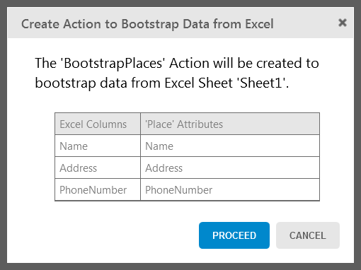

# Bootstrap an Entity Using an Excel File

You can import data from Excel files to load data to your application server
entities. This is quite useful when you are developing and testing your
application.

This way, you can quickly have your data up and running in the application
while developing it.

To bootstrap data from an Excel file to an existing entity:

1. Open the Excel file, check column headers to have the name of an entity attribute. Close the file or the bootstrap cannot read it; 
2. In the development environment, go to the Data layer, right-click on the entity and, in the Advanced menu, choose 'Create Action to Bootstrap data from an Excel...'; 
3. Select the Excel file, check the mappings, and proceed; 
4. Publish to bootstrap the data. 

The Development Environment will automatically create:

* An action with the bootstrap logic named "Boostrap&lt;entityname&gt;" in the Logic tab, Server Actions folder; 
* A structure with the content of the Excel file named "Excel_&lt;filename&gt;" in the Data tab, Structures folder;
* A resource with the Excel file in the Data tab, Resources folder;
* A timer to execute the action at publish time named "Bootstrap&lt;entityname&gt;" in the Processes tab, Timers folder.

When you publish the module, it executes the action to bootstrap the data. If
the entity already has data, the action with the bootstrap logic is not
executed.

## Example

In GoOutWeb, an application for finding and reviewing places, we want to
bootstrap places we have in an Excel file. The Excel file is `Places.xlsx`
and contains values for the mandatory attributes Name and Address, and
PhoneNumber for the places we are adding.

To bootstrap data from the Excel file to the Place entity:

1. Open the Excel file and ensure that column headers names match the names of the Place entity attributes for which you are importing data. Close the Excel file;  

2. In the Development Environment, go to the Data layer, right-click on the Place entity, and in the Advanced menu choose Create Action to Bootstrap Data from an Excel...;
3. Select the `Places.xlsx` file, check the mappings and proceed;

4. Publish to bootstrap the data. 

## Troubleshooting

Make sure you're following these guidelines to import data from Excel without
errors:

* Each Excel sheet must have the name of the Entity; 
* Each column header must have the name of the Entity attribute. 

If your spreadsheet has blank cells and you're getting import errors, check [this Development FAQ](https://success.outsystems.com/Documentation/Development_FAQs/How_to_bootstrap_numeric_data_from_Excel_with_blank_cells) on how to
proceed.