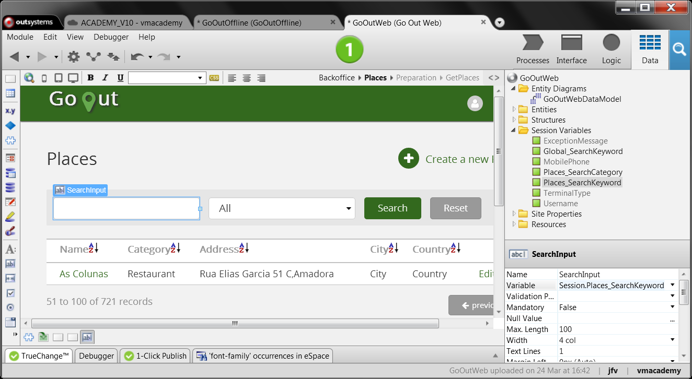

# Maintain State while Navigating across Screens

OutSystems allows you to store the application state and use it throughout
end-user navigation across screens. For example, when navigating to a screen,
render it based on the state you left it.

In web applications, a session is created in the first request an end-user
makes to the server. You can use Session Variables to store the application
state:

1. Open the Data tab of your module and create a Session Variable;
2. In the action flow, assign the values you need to keep in the session variable;
3. When you need to use the state data, get it from the session variable as you would with any other variable.

In mobile apps, OutSystems saves the state of the last visited screen and
restores its state automatically when the end-user navigates back to it. To
persist the state of screens across the flow of your mobile apps, you can use
the local storage.

To store the state of screens using local storage:

1. Create the local storage entities modeling the state data you need to save;
2. Define the logic to persist the captured data in the local storage;
3. Retrieve the state data from the local storage and initialize the screen elements to have the screen rendered with the saved state.


## Example in a Web App

In the GoOutWeb web application, for finding, reviewing and rating places, the
Places screen allows end-users to search for places. The search criteria is
saved in SearchKeyword, a local variable of the screen. Once we navigate to
another screen, the search criteria is lost. What we want is to keep that
search criteria when getting back to the Places screen. For that, we have to
store the search criteria in a Session Variable, instead of a Local Variable.

To create and use a Session Variable:

1. Go to the Data tab and create a Session Variable of type Text, and name it Places_SearchKeyword; 
2. On the Places screen, select the search input widget and replace the local variable with the created session variable; 
3. In the Preparation action, open the GetPlaces aggregate, and change the Filter to use the session variable instead of the local variable:  
    ```
    Place.Name like "%" + Session.Places_SearchKeyword + "%" or
    Category.Label like "%" + Session.Places_SearchKeyword + "%"
    ```
4. Delete the SearchKeyword local variable. Check the errors and replace the local variable by the session variable; 
5. Publish and test. 




## Example in a Mobile App

In the GoOut mobile application, you can find, review and rate places. In the
Home screen, the app allows end-users to filter places based on a category.
The selected category is saved in Filter, a local variable which is associated
with the dropdown widget displaying the categories on the screen.

OutSystems saves the state of the last visited screen and restores its state
automatically but once we navigate across multiple screens, the state of the
category dropdown menu is lost. What we want is to be able to restore that
state when returning to the Home screen. To persist the user's selection
performed on that screen, you can use the local storage.

In this example, we are only storing the value for this filter in the Home
screen, but you can use the same entity/logic to save the state for other
elements/screens.

To do this:

1. **Create a local entity to store the state for an element.** In the Local Storage, create a NavState entity with an attribute Value of type text and set its Id as type text. Each record of this entity will map a key/value pair which you can use to persist the state of a screen element.
2. **To persist and retrieve the element/state from the local storage create two client actions**, in the Logic tab:
    1. **SetState** receives a key and a value as input parameters and persists them both in a NavState record. To do this, add an aggregate of NavState to get the list of its records. Use a filter in the aggregate to get the record where `NavState.Id = StateKey` parameter to update the record for that key if it exists already; assign the values held in the input parameters to the current record of the aggregate's list and use `CreateOrUpdateNavState` to persist the record in the Local Storage.
    2. **GetState** receives a key (NavState identifier) and outputs the value for that key. To this, add an aggregate with `NavState.Id = StateKey` as filter condition to obtain that record. Assign the content of the Value attribute of that record to the output parameter: `StateValue = GetNavStateById.List.Current.NavState.Value`.
3. **Populate the dropdown menu with the last user's selection before rendering the screen.** In the Home screen properties, under events, create a new client action to handle the On Initialize event. In this action: 
    1. Call GetState using the expression `TextToIdentifier("Filter")` to obtain an identifier type you can store in `NavState.Id`. Filter is the local variable holding the dropdown selection.
    2. Assign to Filter the value returned by `GetState`.
4. **Populate the screen with places records of the selected category.** In the screen's local aggregate used as source for the List widget, use the following filter condition `LocalPlace.Category = Filter or Filter = ""`. The first part of the OR condition shows the records for the category selected by the end-user in the user's last interaction with the home screen. The second part of the OR condition shows all the records, when the Filter variable is empty. 
5. **To persist the filter state** (category choice), in the client action handling the On Change  event of the dropdown widget:
    1. Call SetState and set `StateValue` as Filter and the `StateKey` as `TextToIdentifier("Filter")` to store the key/value pair. 
    2. Refresh the `GetLocalPlaces` screen aggregate using a Refresh data node to adjust the source of the List widget.