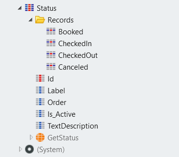
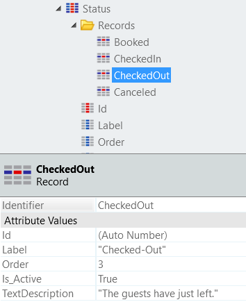

# Static Entities

A **Static Entity** consists of a set of named values. Think of static entities as enums or literal values stored in the database. The structure is defined by the Static Entity attributes, while the data is managed in **Records**. The scope of Static Entities is always global. Static Entities can only have relationships with other Static Entities.

The following attributes are automatically created: **Id**, **Label**, **Order**, and **Is_Active**. 

Id
:   The identifier is a unique record identifier, and it's the only attribute in the Static Entity that can be auto-number.

Label
:   Holds a value that can be displayed in an application.

Order
:   Defines the order by which the records are displayed to the end-user.

Is_Active
:   The boolean Is_Active attribute defines if a record is available during runtime. For example, the records with Is_Active set to false will be ignored when the Static Entity is used in scaffolding.

You can create new entity attributes and define their types.

Each Record within a Static Entity will have an **Identifier** attribute as a unique handle. When designing applications use the Identifier directly in your business logic, for example: `Entities.<StaticEntity>.<Identifier>`.

The only action available for the static entities is the Get&lt;StaticEntity&gt; action, because OutSystems manages the data persistence for you. Static Entity data is editable during design time only.

You can convert existing entities to Static Entities and vice versa. After converting a Static Entity to an Entity, the records become available through database queries and they are deleted from the _Records_ folder.

## Example

Use static entities when you need a predefined immutable (constant) set of values. For example, in a hotel app we will probably need some reservation statuses: "booked", "checked in", "checked out", and "canceled". We also need the default descriptions for the statuses (e.g. "The guests have just left." for "checked out").

Your Static Entity Status may look like this:

All statuses are created in the Records folder of your Static Entity. If you select "CheckedOut", the Properties Editor will show the details:

The Identifier for the checked out status is `CheckedOut`, the Label is `"Checked-Out"`. The field TextDescription is our custom field and has the string value `"The guests have just left."`.

You can access the record for checked out status by referencing its Identifier, like this: `Entities.Status.CheckedOut`.