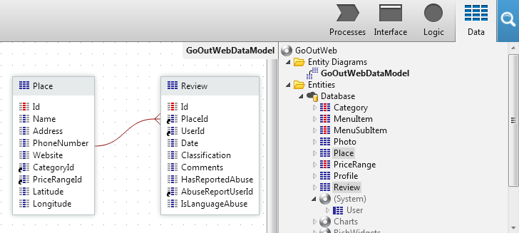

# Create a One-to-Many Relationship

When modeling data, it is sometimes necessary to create one-to-many relationships between entities. An example is when an `Order` (parent entity) can have many `Items` (child entity). This is typically implemented with a foreign key in the child records, that is the identifier of the parent record.
In OutSystems, to create a one-to-many relationship between two entities, do the following:

1. Select the entity with the child records (e. g.: `Item`);
1. Add a new attribute that holds the identifier of the parent entity (e. g.: identifier of the `Order` entity). This attribute will be the foreign key.

In OutSystems, having an identifier attribute pointing to another entity creates automatically a relationship. You can see the relationships between entities if you have them in the same Entity Diagram.

## Example

We have an application called GoOutWeb, that enables users to create reviews for places like restaurants, bars, etc. We want to store the fact that a certain Review was created about a specific Place record.

To achieve this, follow these steps:

1. Go to the Data tab;
1. Add an attribute to the `Review` entity. Name it `PlaceId`. OutSystems automatically infers that its data type is `Place Identifier`. It also creates the relationship between the two entities.
1. In the action that creates `Review` records, make sure that the `PlaceId` attribute holds the identifier of an existing `Place` record that the `Review` is created for;
1. Publish the application.

As a result, you have a one-to-many relationship between the `Place` and `Review` entities:

