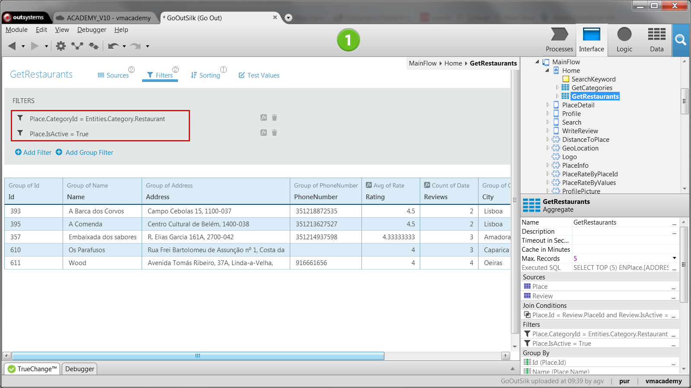

# Filter Query Results

When designing queries, it’s common to add conditions to filter results and
get exactly what you want directly from the database. In OutSystems, this is done by adding Filters to Aggregates, as follows:

  1. Open the  Aggregate;
  2. Open the drop-down menu of the attribute to add the condition and do one the following:
    * Select  Filter... and type the condition or, 
    * Check the values you want, if the attribute is a foreign key to a Static Entity. 

To edit conditions, simply go to the  Filters  option and change the ones you
want.

## Example

In  GoOut, a mobile application for finding and reviewing places, we want to
display a list of active restaurants on the home page. To do this we must
filter the list of places to obtain only the places that belong to the
restaurant category and that are marked as being active:

  1. Right-click the screen Home and select  Fetch Data from Database  to create an aggregate called GetRestaurants.
  2. Drag the Place entity from the Data tab to the aggregate;
  3. On the Category attribute, open the drop-down menu and uncheck all categories except Restaurant;
  4. On the Filters panel, check that the following conditions exist:
      * `Place.IsActive = True`, added automatically by OutSystems to retrieve active places;
      * `Category.Id = Entities.Category.Restaurant`, to retrieve places that belong to the Restaurant category.
  
  5. Add a list to the screen Home that displays the results fetched by the aggregate.