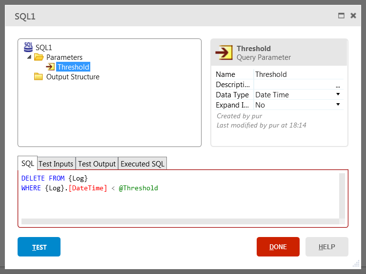

# Write Your Own SQL Queries

In OutSystems, aggregates are the preferred way of querying data since they
are highly optimized and easier to maintain. However, you may need to write
your own SQL to perform advanced queries or delete records in bulk, for
example.

To write your own SQL queries:

1. Add an  SQL tool to an action flow;
2. If necessary, define the query parameters;
3. Write the SQL query;
4. If the SQL query will return records, define the structure used to output the records from the SQL node. The output structure must have the same attributes as the ones returned by the SQL query, in the same order and with matching data types;
5. Use the output list of the SQL node to access the result of the SQL query.

# Example

An application stores activity logs that are useful only during a certain time
span. After that, the logs are no longer useful and can be deleted.

To allow an operator to delete the logs that are older than a date:

1. Create a button to delete the logs of the application and set the property Destination to a new action called CleanupLogs;
2. Open the action CleanupLogs and drag a SQL tool to the action flow;
3. Double click the SQL node and define an input parameter called Threshold of type Date Time;
4. Type the following SQL to delete the logs that have a DateTime older than the Threshold: `DELETE FROM {Log} WHERE {Log}.[DateTime]< @Threshold`  

5. Select the SQL node and set the input parameter Threshold to `AddDays(CurrDate(), -7)` to delete logs older than one week.