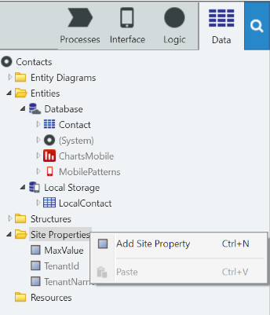

# Use Site Properties to Configure Behaviors at Runtime

In OutSystems, Site Properties are global variables that have a constant value or a value that does not change very often. They are typically used to implement configuration values for the application - such as a maximum value for an application parameter - since they can be set at runtime for each environment with no need to republish the application.

When a Site Property is created, it is set by the developer with a default value. At runtime, someone with privileges can change the Site Property value for a specific environment through the environment management console.

## Create and Use a Site Property

Site Properties exist in the server side of the application. To create and use a Site Property, do as follows:

1. In the Data tab, right-click on the Site Properties folder, and add a site property;  

2. Define the name, data type, and its default value;    
3. Use the Site Property in your server side code by referring to it as `Site.<SitePropertyName>`.

If you want to use the value of a Site Property in the client side logic of a mobile application, you must add a Server Action to get the Site Property value and use that Server Action in your client side logic.

## Example in a Web Application

The GoOutWeb is a web application for finding, reviewing, and rating places. It also allows reporting reviews as inappropriate. Now, we want to block the access to the application to end-users who exceed a number of reviews reported and confirmed as inappropriate.

At the start, the limit is three, but we want to be able to adjust it in time without having to redeploy the application.

We have to create a Site Property and use it to check the limit of confirmed reports per end-user:

1. In the Data tab, right-click on the Site Properties folder to add the site property;
1. Name it MaxReportedReviews and set its data type to Integer;
1. Set the default value to 3;
1. Go to the ReportedReviews screen and open the Confirm screen action;
1. After updating the review as inactive, add an Aggregate to count inactive reviews with reports per end-user;
1. Iterate the aggregate results and check if the count exceeds the Site.MaxReportedReviews. If True, put the end-user as inactive;
1. Publish and test.

## Example in a Mobile Application

In the GoOut mobile application we need to configure the minimum length a comment must have in reviews:

1. In the Data tab, right-click on the Site Properties folder to add the new site property;
1. Name it MinimumCommentLength and set its data type to Integer;
1. Set the default value to 50;
1. Create a Server Action called SiteProperty_MinimumCommentLength that returns the value of the Site.MinimumCommentLength site property;
1. Go to the WriteReview screen. In the Save Client Action, call the SiteProperty_MinimumCommentLength Server Action to get the site property value
1. Implement the logic to validate the size of the comment;
1. Publish and test.