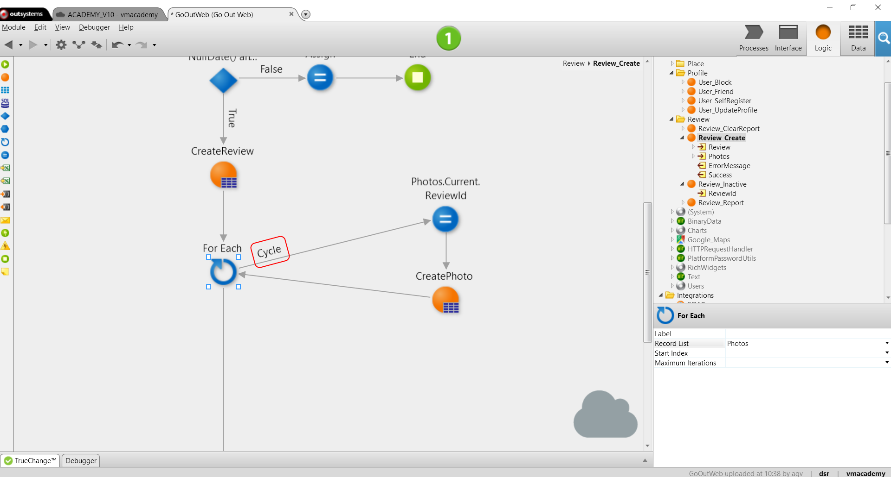

# Use a For Each to Iterate a List

In the logic of your application you may want to to loop over each element in a collection to perform a piece of logic recursively. In OutSystems you can iterate lists using a For Each logic node.

To iterate through the elements of a List:

1. Add a For Each flow element to the action flow; 
1. Set its Record List property to the list you want to iterate; 
1. Implement the instructions you include in the body of the loop. Connect the For Each node with the first instruction in the logic you want to iterate. This first connector is called cycle and marks the beginning of the cycle. 
1. Connect the last step in your logic with the For Each Node to close the cycle. The Current runtime property of a List (`<List>.Current`) holds the item in the list currently being iterated. 

## Example

In the GoOutWeb application, a Web application to search and review places like restaurants or museums, we allow the end-user to add photos to a review of a place. To save each review photo in the database, we need to iterate the list with the photos submitted by the end-user.

To iterate the list of photos:

1. Open the Review_Create action, the action to persist a review to the database; 
1. After the CreateReview action, add a For Each element to the flow; 
1. Assign the Photos list to the Record List property of the For Each; 
1. Add an Assign node. Since the photos are related to the review being submitted, assign the id of the review created, `CreateReview.Id`, to the ReviewId attribute of the current photo being iterated, `Photos.Current.ReviewId`; 
1. Add the CreatePhoto action to the flow and set its Source property as `Photos.Current` to add the photo to the database; 
1. Connect the For Each node with the first instruction in the cycle, the Assign node, this arrow will be marked as Cycle. 
1. Connect the last instruction in the cycle, the CreatePhoto action, with the For Each, this way closing the circle. 

