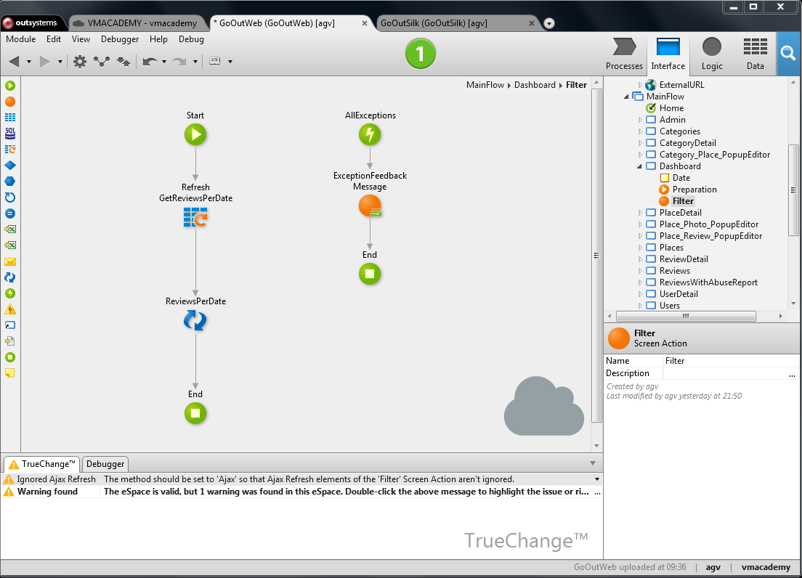

# Use Ajax to Refresh Part of a Screen

Refreshing only certain parts of a screen without having to re-render the whole screen allows improving the end-user experience by creating dynamic interfaces and supporting faster user interactions.

In OutSystems it is possible to update part of a screen on mobile apps and web apps. For web apps, OutSystems uses Ajax to perform asynchronous requests to the web server that fetch only the necessary data to dynamically refresh the screen, without needing to refresh the whole page.

To refresh only part of a screen on a mobile app:

1. Add a button or link to the screen and set the event handler On Click to a new client action. 

1. In the new client action, modify the value of the data bound to the widgets displayed on the screen or update the input values of blocks. For example, update the screen variables or refresh data from the database using the Refresh Data tool. The widgets automatically display the updated data without you having to explicitly do it. 

To refresh only part of a screen on a web app:

1. Add a button or link to the screen and set the property Method to 'Ajax Submit' so that the request to the server is performed asynchronously. 

1. Associate a new screen action with the button or link. 

1. In the new screen action, update the data displayed on the screen. For example, assign screen variables or refresh data from the database using the Refresh Data tool. 

1. Drag the Ajax Refresh from the toolbox to the action flow and select the widget that displays the updated data on the screen. The Ajax Refresh can only refresh widgets that have the property Name defined. 

## Example

We have a Web application to search and review places like restaurants or museums. The application has a back office dashboard to track some key indicators in charts.

One of these charts displays the number of reviews per place category for a date selected in the interface. When the user changes this date the whole page refreshes to display the updated information. However, this also includes other charts for which the date is irrelevant.

To refresh only the chart affected by this date, do the following:

1. Open the screen Dashboard and change the property Name of the container that encloses the chart to 'ReviewsPerDate'. 

1. Select the Filter button and change the property Method to 'Ajax Submit'. 

1. Open the screen action associated with the Filter button; 

1. Drag the Refresh Data from the toolbox to the action flow and select the GetReviewsPerDate aggregate. This is the aggregate that fetches the data from the database to feed the chart. Using the Refresh Data ensures that we fetch updated data from the database taking into account the date selected by the user; 

1. Drag an Ajax Refresh from the toolbox to the action flow and select the container 'ReviewsPerDate' that we named in the first step; 

1. Publish and test. 

