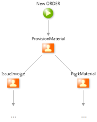
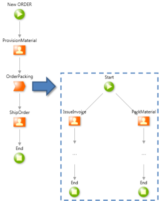
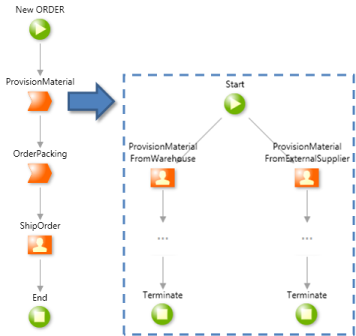
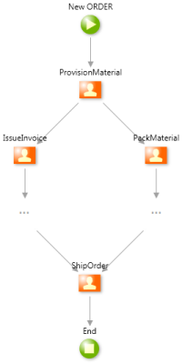
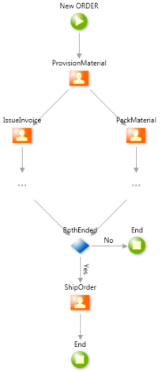

# Designing Parallel Activities

Use this pattern to design multiple paths with activities executed in parallel: simply add outgoing connectors from the activity where the path splits into multiple paths.

When the process is executed, the sequence of activities in each parallel path is executed independently.

## Example

As an example, think of a process to handle orders that starts provisioning the ordered materials and then has two tasks performed in parallel: invoicing and packing materials.

## Joining with Synchronization

To join parallel paths back into a single path, that is executed only when all parallel paths are finished, simply move the parallel paths into a new [Process](../process.md) and use a [Execute Process](<../../../ref/lang/auto/Class.Execute Process.final.md>) to execute that process.

When the process is executed, the Execute Process activity executes another process containing the parallel activities: this process is only finished when all of its parallel activities are finished.

### Example

As an example, think of a process to handle orders: provision materials, invoice and pack materials, and ship the order only when the order is completely packed.

## Joining with Forced Termination

To join parallel paths back into a single path, that is executed once one of the parallel paths is finished, simply move the parallel paths into a [Process](../process.md) and use a [Execute Process](<../../../ref/lang/auto/Class.Execute Process.final.md>) to execute that process. And, in the new process, set the `Terminate` property of **End** elements to 'Yes' to ensure it terminates once a path ends.

When the process is executed, the Execute Process activity executes another process containing the parallel activities: this process terminates once one of its parallel activities finishes.

### Example

As an example, think of a process to handle orders: provision ordered materials either from the existing stock or from an external supplier, handle the order, and then send it.

## Anti-Patterns for Joining Parallel Flows

There are other ways of joining parallel paths but they are anti-patterns, i.e., it is advisable not to use them because they are ineffective and/or counterproductive in practice:

* **Joining with no synchronization**: the joined path is executed multiple times, once by each incoming parallel path, with no synchronization; there's no simple way of using information from each parallel path in the joined path.  

* **Joining with bad synchronization**: a Decision is used for synchronizing parallel paths; the decision's logic is complex and not exempt from concurrence problems, thus it may return wrong outcomes; there's no simple way of using information from each parallel path in the joined path.  

