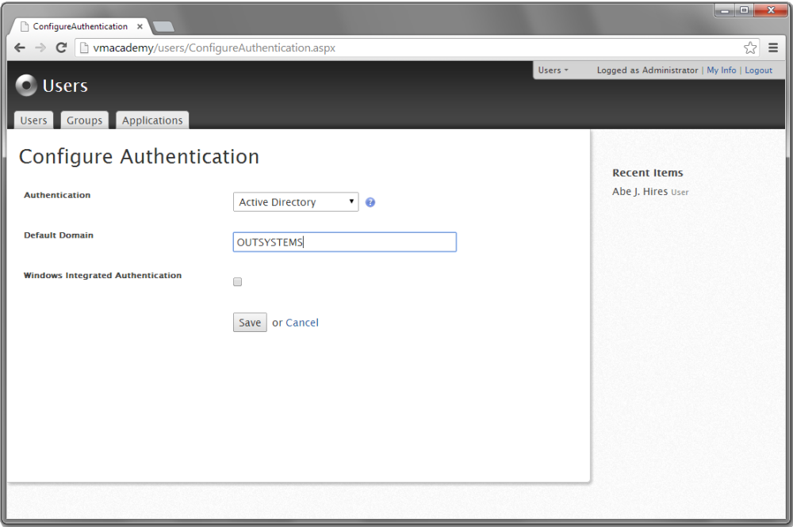
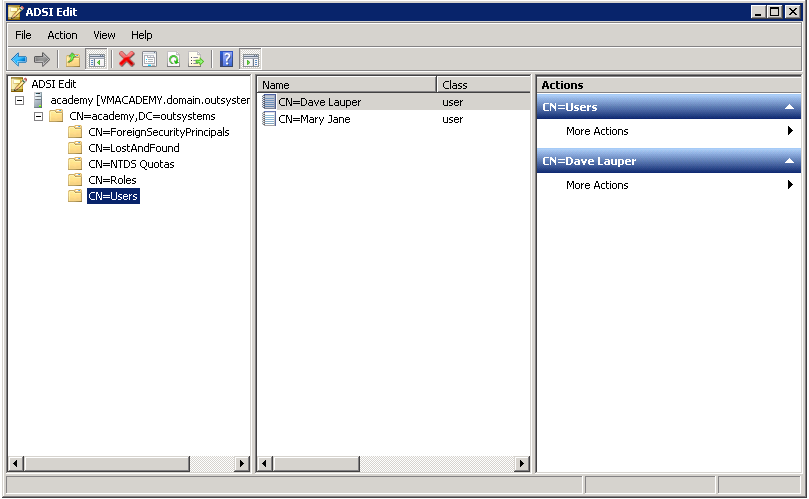
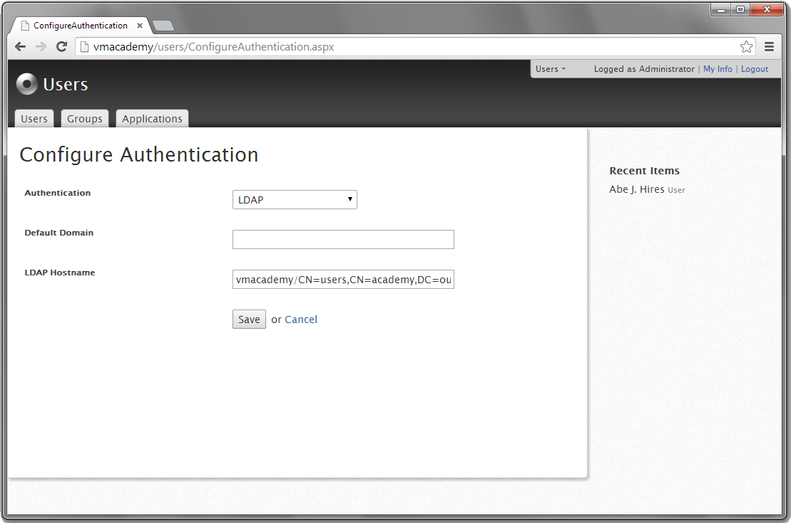

# Configuring End-User Authentication

OutSystems can be configured to authenticate the end-users:

* Internally using credentials stored in its own database;
* Using an Active Directory domain;
* With LDAP configured for Active Directory.

## Configuring the User authentication mode

To configure how end-users are authenticated:

1. Open the Users application at `http://<environment address>/Users`;
1. Click **Configure Authentication**, located in rightmost part of the **Users** tab.
1. Select one of the authentication methods in the **Authentication** drop-down list:  Internal, Active Directory, LDAP.

### Configuring Active Directory domain authentication

The Active Directory authentication method requires the front-end server to be part of the Active Directory domain.

To use Active Directory domain authentication:

1. Choose **Active Directory** in the **Authentication** drop-down list.
2. Add the authentication domain in the **Default Domain** text field.

In the example above, when the end-user `mary.jane` or `john.smith` logs in, OutSystems tries to authenticate them in the domain using the `OUTSYSTEMS\mary.jane` and `OUTSYSTEMS\john.smith` usernames.

If you want to enable Integrated Windows Authentication for all applications, click the **Windows Integrated Authentication** check box. If want to enable it only for a selected number of web screens, web flows or web services, do it in Service Studio when designing your application.

### Configuring LDAP Authentication with Active Directory

To configure the OutSystems end-user authentication for LDAP server and Active Directory:

1. Choose **LDAP** in the **Authentication** drop-down list.
2. Optional: in the **Default Domain** field, enter the domain where end-users are going to be authenticated. This field is optional.
3. In the **LDAP URL** field, enter the URL of the following format: `ldap://<LDAP Server>:<Port>/<Base Distinguished Name>`. To use secure LDAP, use the protocol `ldaps://` instead.

In the example that follows, the LDAP server hostname is `VMACADEMY`, it responds on port `389` (default), and directory end-user information is stored under the `CN=users,CN=academy,DC=outsystems` path.

To authenticate end-users in this LDAP server, use the configuration as in the following example:

