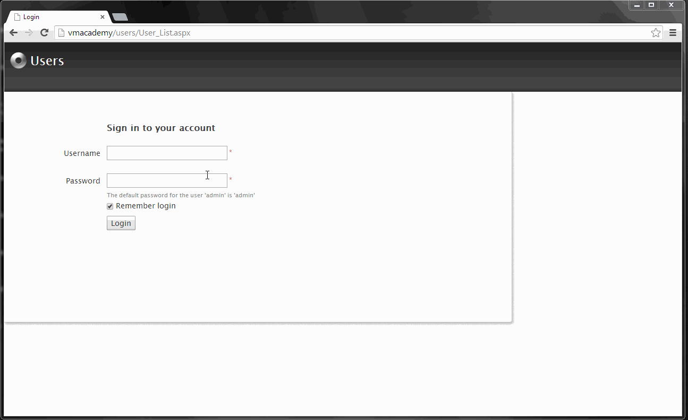

# End-User Management

Use OutSystems Users application at `http://<environment address>/Users` to create, update and delete the end-users (users of your applications) and their roles. You can also use it to manage roles individually or in bulk by using groups.

## Adding, deactivating and deleting Users

To create a new User, click **Create a new User** on **Users** tab. After entering the end-user details like username, password and email, you can assign roles to the end-user, or add the end-user to a group in the edit screen.

A User can be deactivated. This prevents the end-user to log in and suspends all granted permissions. To deactivate a User, navigate to the details screen by clicking on the name and **Set as inactive**. To reactivate the account, click **Set as Active**.

To permanently delete an end-user account, go to the edit screen by clicking **Edit this User** on **Users** tab, and then click **Delete this User**.

## Assigning Role to User

Roles are created when you design your application and allow you to grant access to applications, specific screens, or specific tasks.

Once your application is deployed, you can control which end-users have which roles: in the Users application, find and click the end-user to edit the details. Then choose one of the existing roles in the **Roles** details.

In the example above, `jamie.foster` has been assigned the ExpensesFinancialController role. This grants her access to approve expense reports in the Expenses application.

## Using Groups

When creating a new end-user, it is often necessary to assign multiple roles. Instead of manually assigning roles to end-users, you can create an end-user group and assign the roles to the Group. Add the end-users to the group to grant them permissions or remove the end-users from the group to revoke the permissions.

Use **Groups** tab to:

* Create and delete groups. A new group has no roles or end-users.
* Assign roles to group or remove roles from group. All group members will be given the roles or removed from them.
* Add end-users to a group or remove end-users from a group. The end-user will get or lose the privileges of all the roles assigned to the group.

## Using Users API

OutSystems offers [Users API](<../../../ref/apis/users-api.md>) to access end-user management programmatically. Use the API to write your own applications for managing end-users or for exposing APIs to external systems through Web Services.