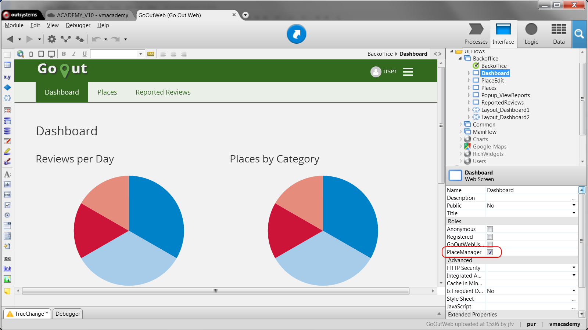
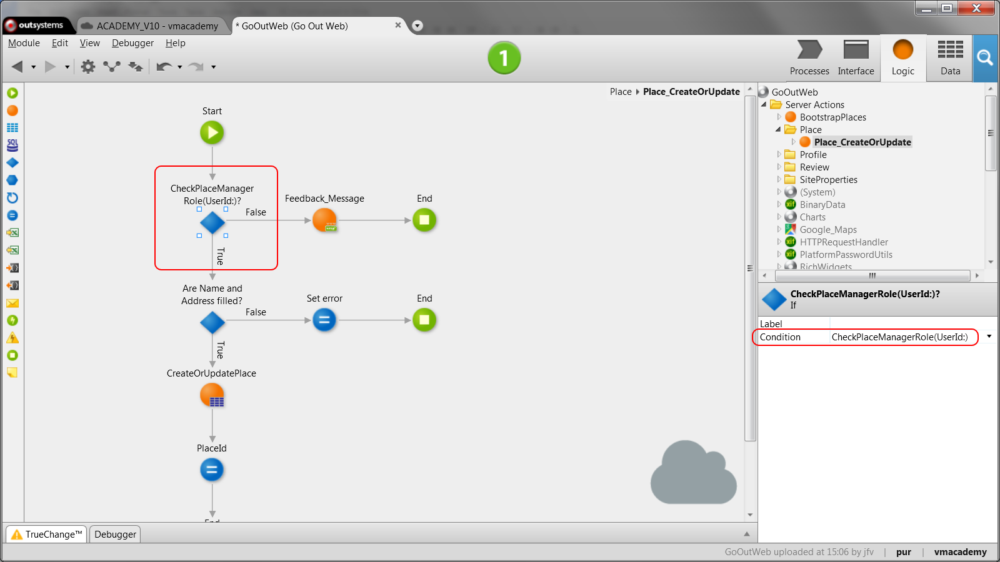

# Validate End-User Permissions in the Application

If you need to restrict end-user access to specific areas or operations in an
application, you must validate their permissions. In OutSystems, for Web
applications, you can do that based on roles to control access to screens,
screen elements or actions.

To validate the permissions of end-users to screens of the application:

1. Open the screen; 
2. On the  Properties  editor, select the end-user roles that can view the screen. 

To validate the permissions of end-users to screen elements or actions of the
application, use the CheckRole built-in functions to determine if the end-user
has the necessary roles. You can use these functions to:

* Hide or display the interface elements using If elements; 
* Block or allow executing the actions. 

##  Example in a Web App

In GoOutWeb, to find, review, and rate places, we have roles for regular end-
users and managers. End-users can review existing places and suggest new
places. Managers can also edit and remove places, operations which they can
perform via a  Dashboard  screen. We want to guarantee only managers have
access to the  Dashboard  so we have defined the  PlaceManager  role for this
end-user group.

To restrict access to screens and operations from end-users that are not
managers:

1. Open the Dashboard screen and in the Properties editor, ensure that only the PlaceManager role is checked;   

2. To hide the link that gives access to the Dashboard screen in the menu of the application screens, open the Menu Block, select the link and enclose it in an If element; 
3. In the condition, verify if the user has the PlaceManager role by using the function CheckPlaceManagerRole. Display the link when the condition evaluates as True; 
4. To guarantee that the end-users cannot edit places, open the action Place_CreateOrUpdate and add an If tool. Check if the user has the PlaceManager role, as done in the step before. If yes, execute the action; otherwise, send a message reporting the cause and exit the action.   
  

