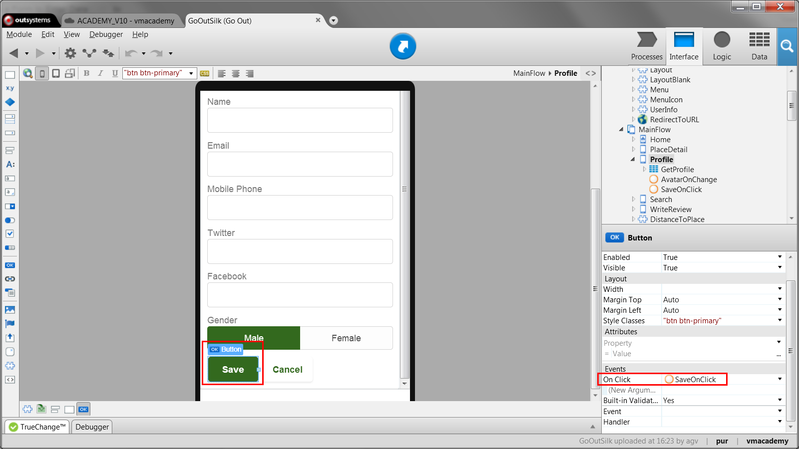
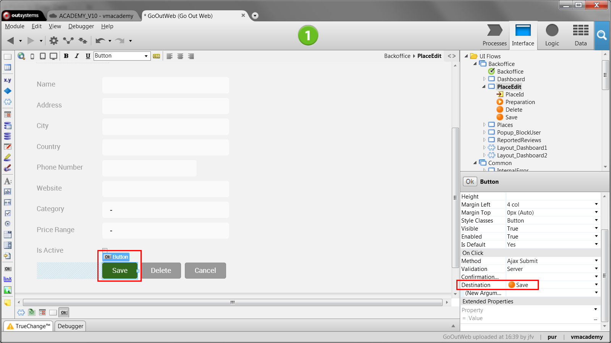

# Use a Form to Group Input Widgets

The use of forms for end-users to enter data and store it in database records
is a common application pattern. In OutSystems, use the Form widget for that
matter.

In a mobile app, the screen must have an aggregate or a variable to hold the
form’s data.

Implement the form as follows:

1. Add the Form widget to the screen; 
2. Drag the aggregate or variable (or any attribute) to the form to create the inputs. A Save button is automatically added; 
3. Associate a client action to the Save button that calls a server action to store the aggregate/variable record in the database. 

In a web app, the screen must have an aggregate or a variable that defines the
form record and holds the initial values.

Implement the form as follows:

1. Add the Form widget to the screen and set Source Record to the aggregate/variable; 
2. Add inputs to the form and bind them to the attributes of the form record; 
3. Add a Button to the form; 
4. Associate an action to the button that stores the form record in the database. 

## Example in a Mobile App

In the GoOut application, the mobile version of the application, let’s allow
end-users to edit their profile. There is already a Profile screen with an
aggregate that fetches the current user and its profile from the database. We
need to add inputs to edit that data.

1. Drag and drop the Form widget to the screen; 
2. Drag and drop the aggregate to the form. The Save button is automatically added; 
3. Select the Save button and create a new client action in its Destination property;
  
4. In the action flow, call the server-side action that updates the User and Profile passing the record `GetUserAndProfile.List.Current` as argument; 
5. Publish and test the application. 

## Example in a Web App

In the GoOutWeb application, for finding, reviewing and rating places, we want
to add new places and edit the existing ones. There is already the PlaceEdit screen with the Place identifier (PlaceId) as the input parameter. It has an
aggregate that fetches the place from the database.

1. Drag and drop a Form widget to the screen; 
2. Set the aggregate result (`GetPlaceById.List.Current`) as Source Record of the form; 
3. Drag the Place entity from the Data tab and drop in the form to create the inputs; 
4. Drag and drop a button to the bottom of the form. Set the button Label to “Save”; 
5. In the button Destination property, select to create a new screen action;
  
6. In the action flow, call the CreateOrUpdatePlace entity action, passing the form variable `PlaceForm.Record`; 
7. Publish and test the application. 
