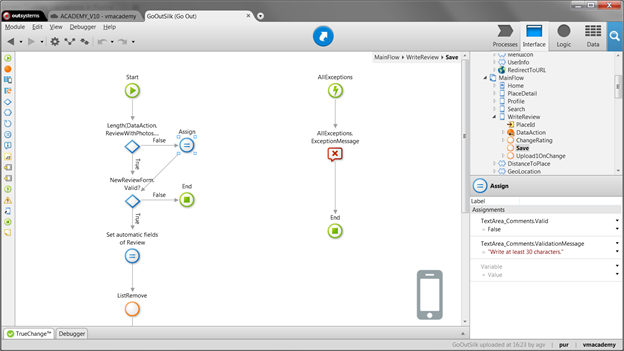
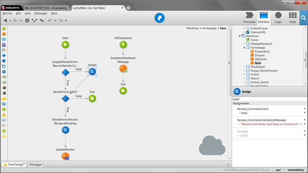

# Validate Form Inputs

When a form is submitted, OutSystems performs built-in validations for
mandatory fields and valid data types. However, you can also add your own
custom form validations.

In mobile apps, use the client action that is executed when the form is
submitted to perform client-side validations. Add all validations to the
action flow before the existing If element that tests the value of Form.Valid.

For each validation:

1. Add the logic to validate the input value. For example, using an If element; 
2. If the validation fails, set the input’s runtime properties as follows:
    * `Input.Valid = False`  
    * `Input.ValidationMessage = "<your error message>"`

If any of the built-in validations fail or you assign `False` to the Valid runtime property of any field of the form, the Valid property of the form is automatically assigned to `False`. In this case, the validation messages are displayed next to all the corresponding inputs that are not valid. If you
want to validate inputs on the server side, send them as inputs to a server action where you implement your server-side validation logic.

In web apps, use the server action that is executed when the form is submitted to implement the form validations. Add all validations at beginning of the action flow:

1. For each validation:    
    1. Add the logic to validate the input value. For example, using an If element; 
    2. If the validation fails, set the input’s runtime properties as follows:    
    * `Input.Valid = False`
    * `Input.ValidationMessage = "<your error message>"`
2. Check the value of  Form.Valid  after all input validations because if any of the inputs is not valid, the form is also not valid:     
    1. Add an If element with the following condition: `Form.Valid`
    2. If `True`, continue the action flow; 
    3. If `False` , end the action flow. The form displays validation messages next to all inputs that are not valid. 

If any of the built-in validations fail or you assign `False` to the Valid runtime property of any field of the form, the Valid property of the form is automatically assigned to `False`. In this case, the validation messages are displayed next to all the corresponding inputs that are not valid.

## Example in a Mobile App

In the GoOut application, a mobile application for finding, reviewing, and rating places, we want the review comments to have at least 30 characters. We have a WriteReview screen to submit reviews. It has a Save button that calls the Save client action. Implement the validation as follows:

1. Add an If element to the flow with the following condition: `Length(Review.Comments) >= 30`
2. In the  False  branch, set the runtime properties:
    * `TextArea_Comments.Valid = False`
    * `TextArea_Comments.ValidationMessage = "Write at least 30 characters."`
3. Connect both the If and the Assign elements to continue the action flow;
4. Publish and test adding a review with less than 30 characters.

## Example in a Web App

In the GoOutWeb application, a Web application for finding, reviewing, and rating places, we want the review comments to have at least 30 characters. We have a form on the home page to submit reviews. It has a Save button that calls the Save screen action.

Implement the validation as follows:

1. Add an If element to the flow with the following condition: `Length(ReviewForm.Record.Review.Comments) >= 30`
2. In the  False  branch, set the runtime properties:    
    * `Review_Comments.Valid = False`
    * `Review_Comments.ValidationMessage = "The minimum is 30 characters"`
3. Add an If element with the following condition: `Form.Valid`
4. If True, continue the action flow. If False , end the action flow; 
5. Publish and test adding a review with less than 30 characters. 

