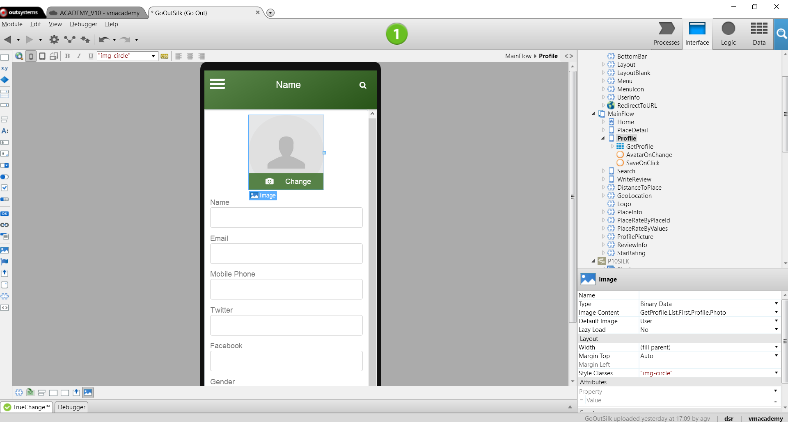
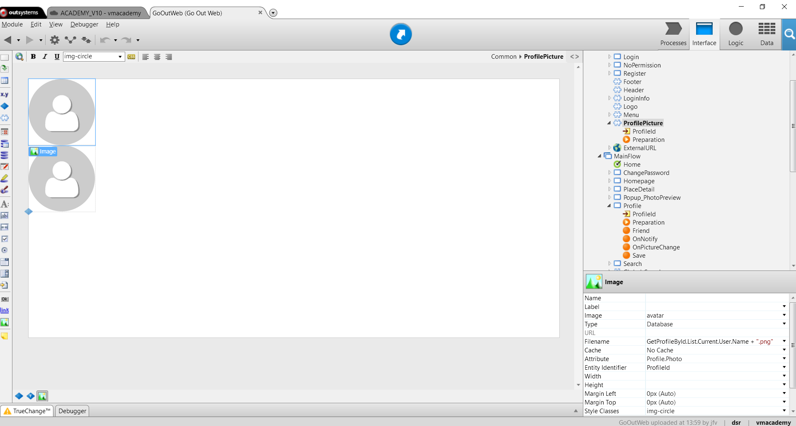

# Display an Image

OutSystems allows displaying different types of images in your applications
such as static images, external images fetched from URLs, and images stored in
the database.

To display a database image in a mobile app:

1. Add an aggregate to fetch the image from the database to the screen where you want to display it; 
2. Drag the Image widget from the toolbox to the screen; 
3. Set the property Type to `Binary Data`; 
4. Set the property Image Content as the entity attribute that stores the image.

To display a database image in a web app:

1. Add an aggregate fetching the image from the database to the preparation action of the screen where you want to display it; 
2. Drag the Image widget from the toolbox to the screen; 
3. Select an existing image resource or import a new image as an image default. This image is used as a placeholder during design time and as default during runtime; 
4. Select the image and change its property Type to `Database`;
5. Set the Attribute property to an entity attribute of type `Binary Data` that stores the image in the database; 
6. Set the Filename property to the name of the file when the end-user saves the image;
7. Set the Entity Identifier property to the identifier of the specific entity record that contains the image to display. 

## Example in a Mobile App

In GoOut, a mobile application for finding and reviewing places, we want to
display the end-user’s photo next to the detail.

To display the end-user's profile image:

1. Open the Profile screen and drag an Image widget from the toolbox to the top of the form with the details of an end-user; 
2. Set the Type property to `Binary Data`; 
3. Set the Image Content property to `GetProfile.Profile.Profile.Photo`, which is the Photo attribute of the GetProfile aggregate that fetches the end-user profiles; 
4. Set the Default Image property to a generic avatar image which the application will display as default if the end-user does not have a profile photo;
  
5. Publish and test. 

## Example in a Web App

In the GoOutWeb application, a web application for finding and reviewing places, we want to display the photo of the end-users next to their personal details in the screen Profile.

To display a database image:

1. Open the Profile screen and drag an Image widget from the toolbox to the top of the form that edits the end-users details; 
2. On the Select Image dialog, select an image already imported into the module or import a new one to be used as a default image. This image is used as a placeholder during design time and as fallback during runtime; 
3. Set the Type property to `Database`; 
4. Set the Attribute property to `Profile.Photo`, which is the attribute storing the photo of the end-users in the Profile entity; 
5. Set the Filename property to `GetProfileById.List.Current.User.Name + “.png”` to define the image filename as the name of the end-user being edited; 
6. Set the Entity Identifier property to the ProfileId input parameter that identifies the  Profile  record for the current end-user;
  
7. Publish and test.
