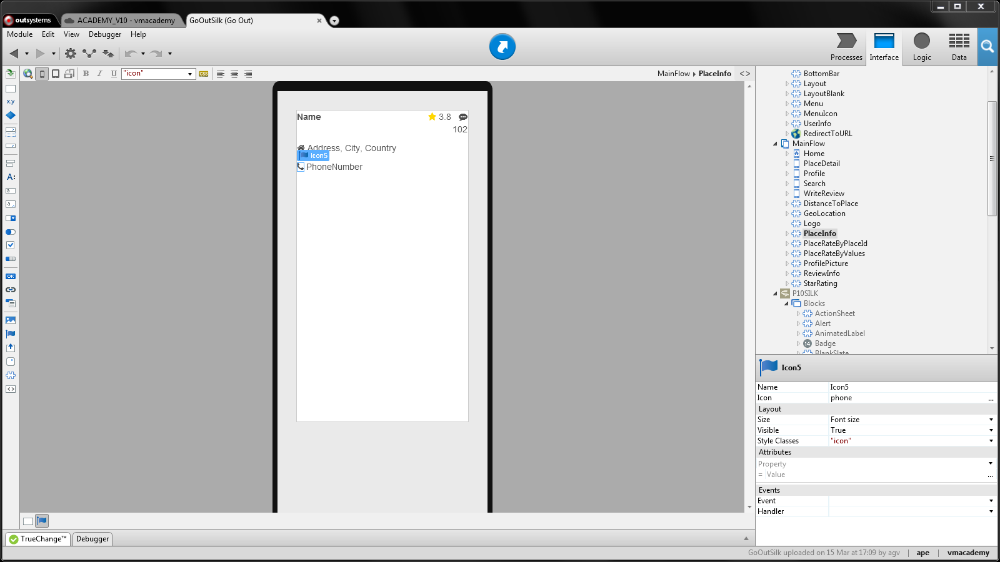
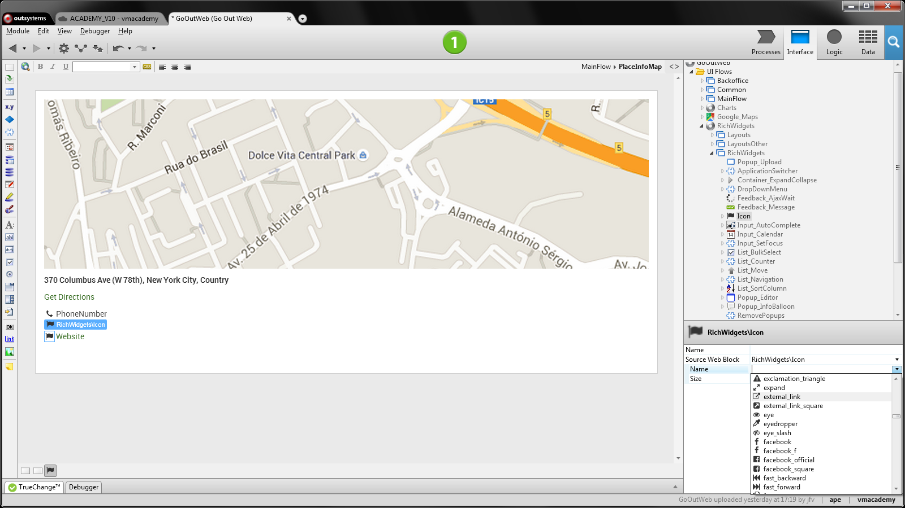

# Use Icons

Icons are small pictograms or symbols to help end-users identify functionality
or information on screens. OutSystems provides a built-in collection of icons
that can be used on the interface of applications.

To use an icon in mobile apps:

1. Drag the Icon widget from the widgets toolbox and drop it onto the screen;
1. Select the icon you want to use and click OK; 
1. Select the icon size.

To use an icon in web apps:

1. In the Interface tab, go to Rich Widgets and drag an Icon block to the screen; 
2. Expand the dropdown list in the Name property and select the icon to display. 

## Example in a Mobile App

In GoOut, a mobile application for finding and reviewing places, we want to
display icons next to the address and phone number of each place to make it
easier for end-users to identify the category of each information.

To add the icons to the information of each place:

1. Open the PlaceInfo block; 
2. Drag the Icon widget to the left of the expression displaying the address of the place; 
3. Select the home icon; 
4. Drag another Icon widget to the left of the expression displaying the phone number. 

## Example in a Web App

In the GoOutWeb application, the web version of the GoOut application, we want
to display icons next to the phone number and website of a place to help end-
users identify the information.

To add the icons to the place details:

  1. Open the PlaceInfoMap block; 
  2. In the Interface tab, go to the Rich Widgets, and drag an Icon block to the left of the expression displaying the phone number; 
  3. Choose the phone icon from the list in the Name property; 
  4. Drag another Icon block to the left of the expression displaying the website; 
  5. Expand the dropdown list in the Name property and select the external_link icon. 

