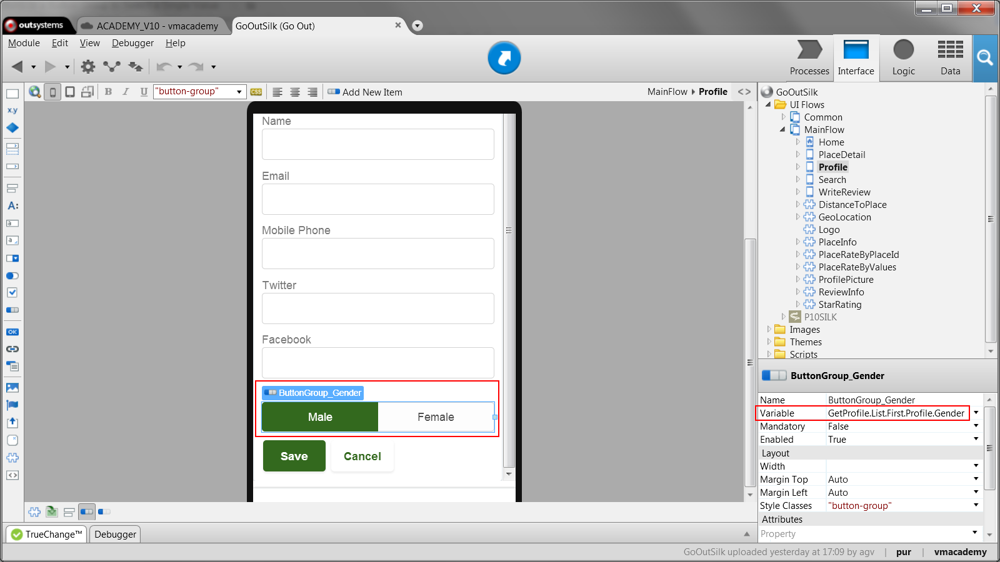
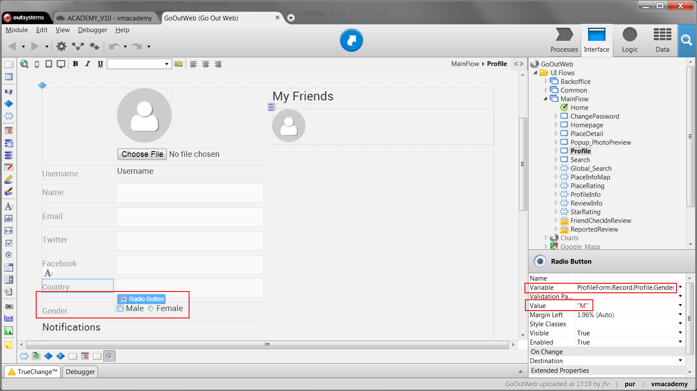

# Pick Only One Option in a Group of Choices

Sometimes end-users have to choose a single value from a set of predefined
options like, for example, the gender. In OutSystems, you can implement these
cases using **Button Groups** in mobile applications or **Radio Buttons** in
web applications.

To use a Button Group in mobile applications, do the following:

  1. Drag the Button Group from the toolbox into the screen and bind it to the variable that will store the selected value; 
  2. For each ButtonItem, edit the corresponding text label and define the value to assign to the variable when the ButtonItem is selected. 

To use Radio Buttons in web applications, do the following:

  1. Drag the Radio Buttons from the toolbox into a form and add the corresponding text labels; 
  2. For each Radio Button, bind it to the variable that will store the selected value; 
  3. For each Radio Button, define the value to assign to the variable when the Radio Button is selected. 

## Example with a Button Group

In the GoOut application, a mobile application to find and review places of
interest, we want to allow users to select their gender in their profile.

Do this as follows:

  1. Open the screen UserDetails and drag a Button Group from the toolbox into the form; 
  2. Set the Variable property of the Button Group to `GetProfile.List.First.Profile.Gender`. This will store the selected value on the attribute Profile.Gender of the aggregate GetProfile; 
  3. Change the text labels of the first two Button Items to `Male` and `Female`. Remove the third Button Item; 
  4. Set the Value property of the Button Items to `M` and `F`, accordingly; 
  5. Publish and test. 

## Example with Radio Buttons

In the GoOutWeb application, a web app to find and review places of interest, we want to allow users to select their gender in their profile.

Do this as follows:

  1. Open the Profile screen and drag two Radio Buttons from the toolbox into the form; 
  2. Add the text labels `Male` and `Female` next to the Radio Buttons; 
  3. Set the Variable property of each Radio Button to `ProfileForm.Record.Profile.Gender`. This will store the selected value on the attribute Profile.Gender of the form; 
  4. Set the Value property of the Radio Buttons to `M` and `F`, accordingly; 
  5. Publish and test. 

