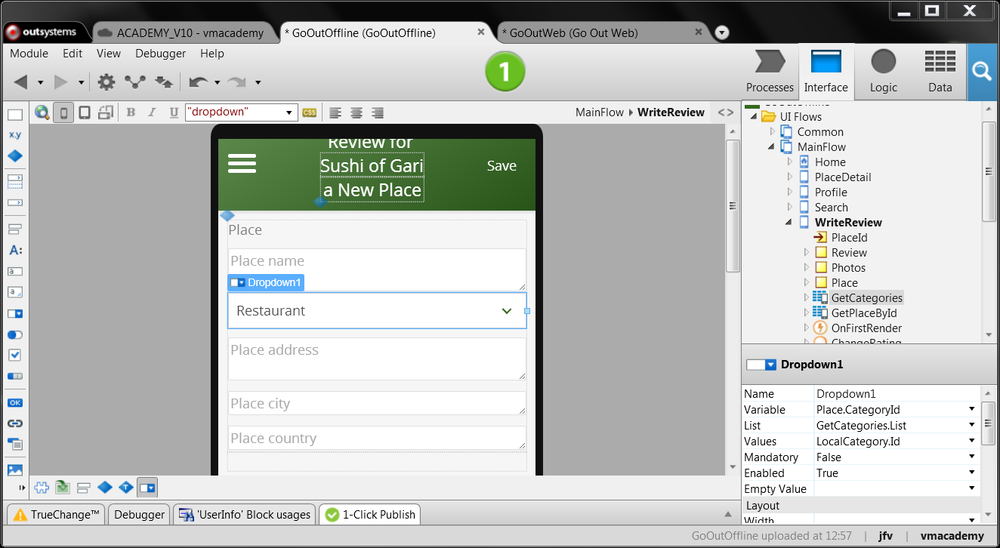
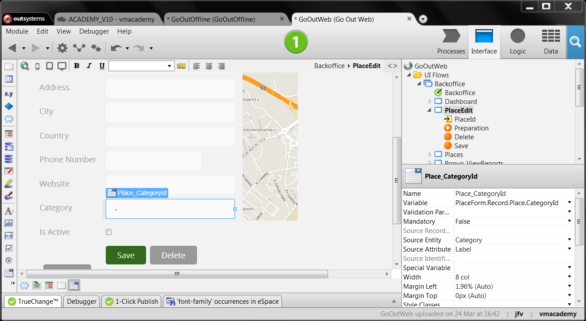

# Choose One Value from a List

In some situations, instead of typing a value, we want end-users to choose
that value from a list of predefined values. In OutSystems, implement this
using a **Dropdown widget** (in mobile apps)
or a **Combo Box widget** (in web apps).

In a mobile app:

  1. Drag the Dropdown widget from the toolbox into the form; 
  2. Set the  List  property with the list of values to display in the Dropdown;
  3. In the  Values  property, select the attribute that identifies the displayed values; 
  4. Set the  Variable  property with the variable that will hold the chosen value; 
  5. In the widget tree, inside the Dropdown, set its expression with the value to display. 

In a web application:

  1. Drag the Combo Box from the toolbox into the form; 
  2. Feed the Combo Box in one of two ways: 
      * **Through a List**
        1. Set the Source Record List property with the list of values; 
        2. In the Source Attribute property, select the attribute to display in the list. 
      * **Directly from an Entity**
        1. In the Source Attribute property, select the attribute to display from the entity; 
        2. Set the Source Entity property with the entity with the predefined values to display in the Combo Box; 
  3. Set the Variable property with the variable that will hold the chosen value. 

##  Example in a Mobile Application

In the GoOut app, a mobile application to find and write reviews about places,
we want to allow end-users to write reviews about new places. In these cases,
the WriteReview screen will show three extra inputs for the new place:

  * Name; 
  * Category; 
  * Address. 

The category is a list of values, so we will implement it with a  Dropdown
widget. We will use the  GetCategories  aggregate  to get all categories:

  1. Open the WriteReview screen; 
  2. Drag the Dropdown widget from the toolbox into the form, and drop it between the name and address inputs; 
  3. Set the List property to the list of categories `GetCategories.List` ; 
  4. Set the Values property to `Category.` `Id` to define the identifier of each value in the Dropdown; 
  5. Set the Variable property to `Place.CategoryId`; 
  6. In the widget tree, inside the Dropdown, set its expression to `GetCategories.List.Current.Category.Label`; 
  7. Publish and test.

##  Example in a Web Application

In the GoOutWeb app, the web version of the GoOut app, we want to set the place category when editing it. We have the Category static entity that holds all categories:

  1. Open the PlaceEdit screen; 
  2. Drag the Combo Box widget from the toolbox into the form; 
  3. Set the Source Entity property to the Category static entity  ; 
  4. Set the Source Attribute property of the Combo Box to `Category.Label` to display the label of each category; 
  5. Set the Variable property to the place category: `PlaceForm.Record.Place.CategoryId`. This property specifies the variable that will store the value selected by the end-user in the Combo Box. 
  6. Publish and test.

