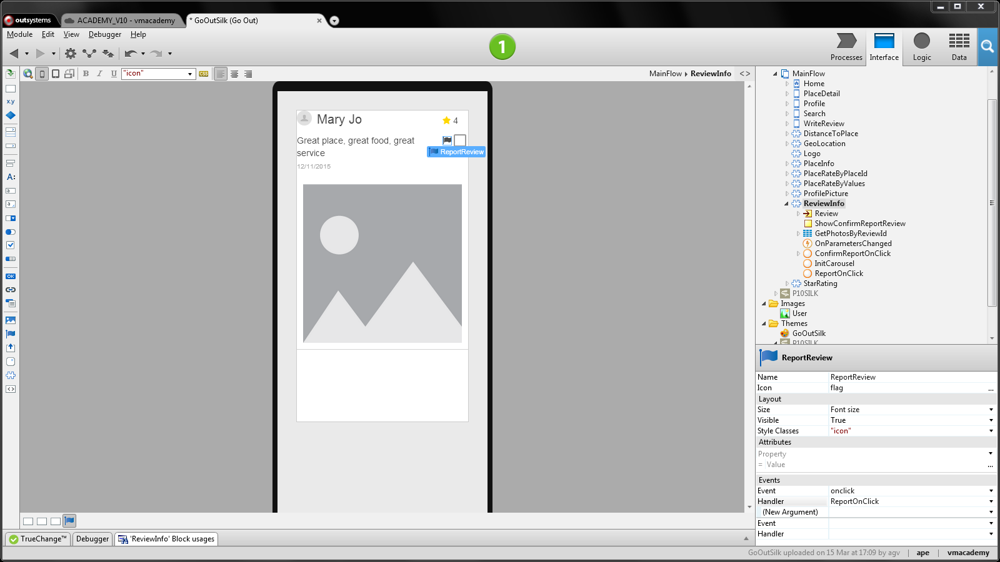
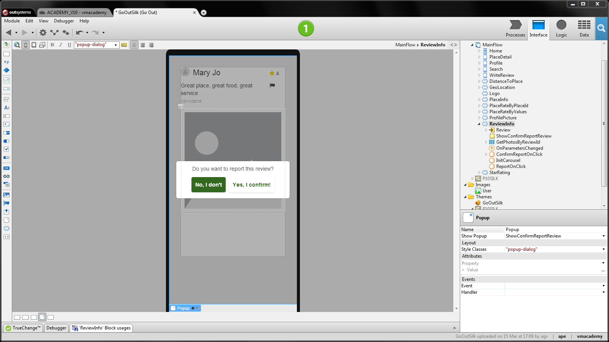
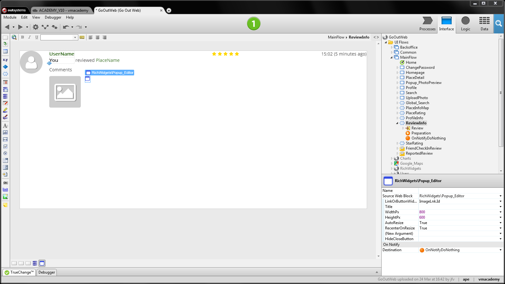
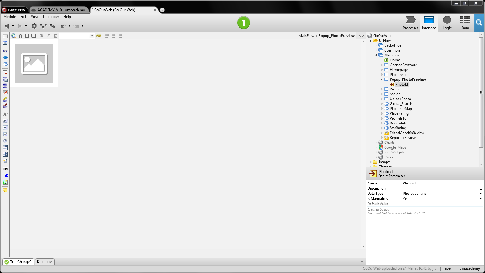

# Create and Use a Popup

Popups are frequently used to ask for end-user input or to present
information. This provides a better experience to end-users because they are
kept in context while entering the input.

In mobile apps, use a popup as follows:

  1. Drag the Popup widget to the screen; 
  2. Add a variable of Boolean type to the screen to control the popup visibility (you can use it to show or hide the popup); 
  3. Set the Show Popup property with the variable. This will effectively toggle the popup according to the variable value; 
  4. Implement logic in the screen to display the popup by assigning `True` to the variable; 
  5. Implement the popup content. 

In web apps, use a popup as follows:

  1. Enclose the screen widget that opens the popup inside a link or button and name the link or button; 
  2. Create a new screen for the popup. Set the layout of the screen to `LayoutsOther\Layout_Popup`; 
  3. Back to the previous screen, set the link’s Destination to the popup screen;
  4. Use the search bar to look for the Popup_Editor and drag it to the screen; 
  5. Set the Popup_Editor LinkOrButtonWidget property with the Id runtime property of the link or button; 
  6. Choose **(New Screen Action)** in the Popup_Editor OnNotify Destination  property. Since we don’t want to run any logic, leave the action’s flow empty;
  7. Implement the popup. To close it, use the `Popup_Editor_Close` action. 

## Example in a Mobile App

In the GoOut application, to find, review, and rate places, we want to display
a popup to end-users to confirm they want to send the review report when they
think a review as abusive language.

  1. Open the ReviewInfo block, the block that displays the review details; 
  2. Drag the popup widget to the screen next to the icon that once clicked; 
  3. Add a local variable to the screen and name it `ShowConfirmReport`. Set its data type as `Boolean`; 
  4. Set the Show Popup property of the popup to the new variable. The popup will be displayed according to the variable’s value; 
  5. In the screen, add a `ReportOnClick` client action to show the popup (i.e. ShowConfirmReport is `True`); 
  6. Set this action to the OnClick event of the icon that reports the review; 
    
  7. Create the popup content as the image below:   
    
  8. To hide the popup after clicking one of its options, implement the logic to set the variable ShowConfirmReport to `False` in the ReportOnClick action. 

## Example in a Web App

In the GoOutWeb application, to find, review, and rate places, each review can have photos associated. These photos are shown as thumbnails along with the review comments and a rating in a block called ReviewInfo. We want to preview the photo in its original size without losing the context of the place and the reviews.

  1. Open the ReviewInfo block; 
  2. Enclose the image thumbnail in a link. Name the link as `ImageLink`; 
  3. Create the Popup_PhotoPreview screen and set the layout of the screen to `LayoutsOther\Layout_Popup`. This screen will display the popup content; 
  4. Add the PhotoId input parameter to get and display the image;
    
  5. Back to the ReviewInfo block, set the link’s Destination to Popup_PhotoPreview and define input parameter with the id of the photo do display in the popup;
  6. Use the search bar to look for the Popup_Editor block and drag it to the screen, next to the image; 
  7. Set the Popup_Editor LinkOrButtonWidget property to `ImageLink.Id`; 
  8. Choose **(New Screen Action)** in the Popup_Editor OnNotify Destination property. Since we don’t want to run logic in response to end-user interaction on the popup, leave the flow of the created action empty.  
    
