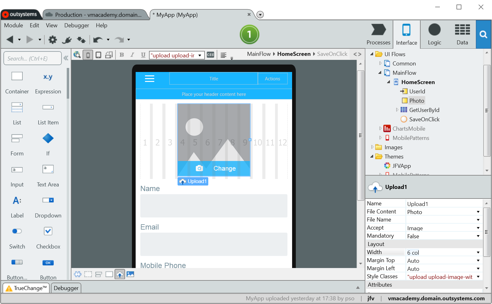
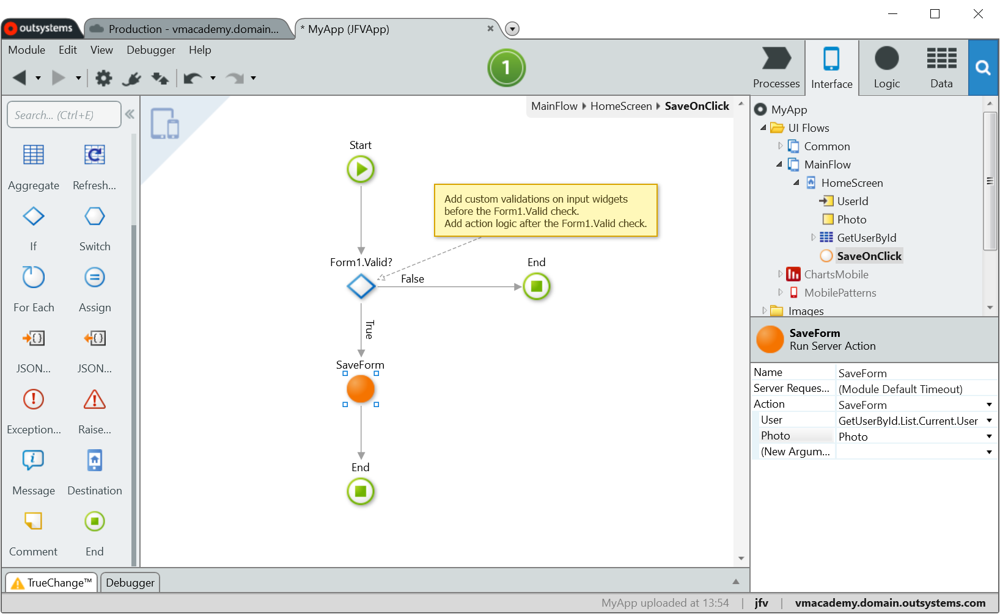
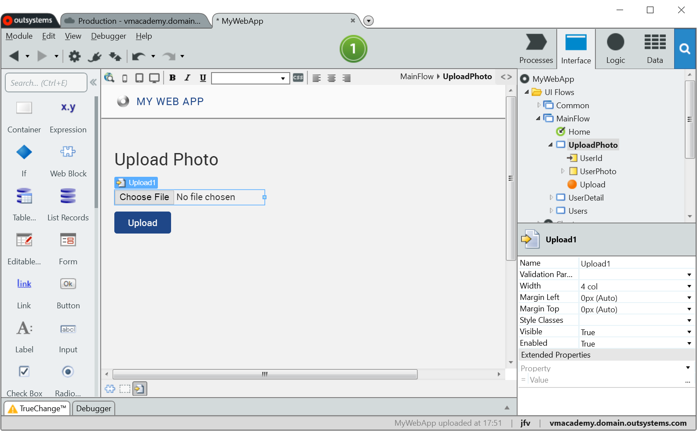
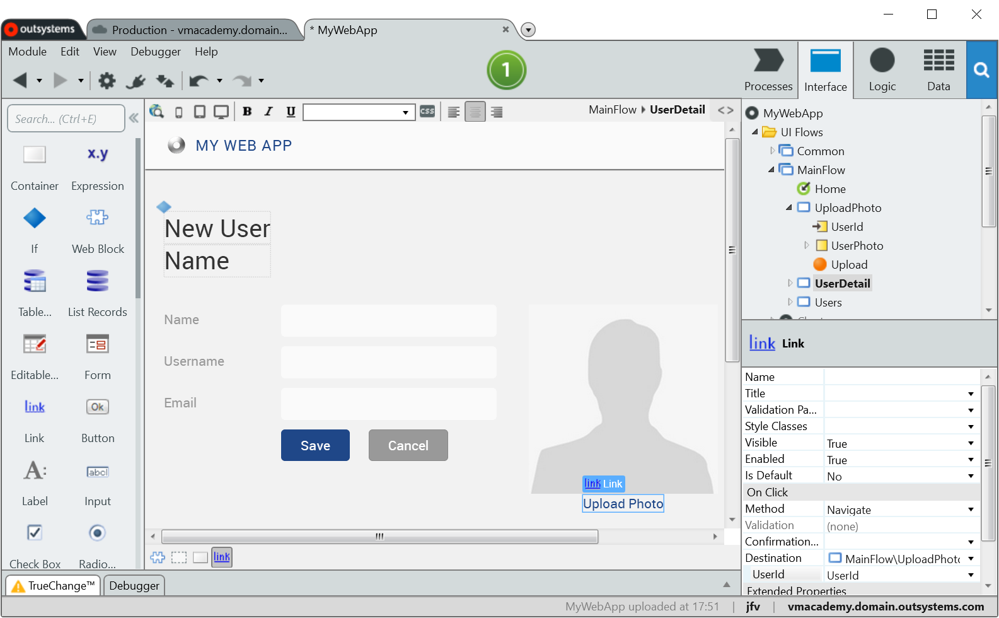

# Enable End-Users to Upload Files

Use the Upload widget to add files to your application like, for example,
photos. The widget is identified by the following icons:

   Upload widget in Mobile apps;

   Upload widget in Web Apps.

To upload a file in a Mobile app:

1. Drag the Upload widget from the Widgets toolbar to the screen; 
2. On the screen, create a Binary Data variable to hold the file  content; 
3. Put the variable in the  File Content  property of the Upload widget. Optionally, there are other properties that can be used:
    * Set the File Name property with a Text variable to hold the filename. It may be useful to have the file name and know the file type; 
    * Change the Accept property value to use specific mobile widgets adapted for the type of file in use; 
4. Use a Client Action to call a Server Action to send the file to the server.

To upload a file in a Web app:

1. Create a new screen and drag the  Upload widget from the Widgets toolbar; 
2. Add a Button to the screen that executes a Screen Action to save the file. Ensure the button's  Method property is set to Submit; 
3. To save the file in the screen action, use the Runtime Properties of the Upload widget:
    * Upload.Content  : the file content; 
    * Upload.Filename  : the file name; 
    * Upload.Type  : the file type. 
4. In the screen you want to upload the file, create a link to navigate to the newly created screen with the Upload widget. Alternatively, avoid the navigation to the screen and put the screen with the Upload widget inside a [popup](popup.md).

## Example in a Mobile App

In a Mobile app, there's a profile screen with a [Form](../forms/form-use.md) to enter user data. To add a user photo, do the following:

On the screen:  

1. Drag and drop the Upload widget to the top of the form. Set the Width to 6 columns; 
2. Add a local variable called Photo to the screen with Binary Data data type; 
3. Set the upload widget's File Content property to the Photo local variable.

Implement the following logic when saving the form:  

1. On the server side, change the **server** action that saves the form data in the database to accept the Photo variable as input parameter and save it also; 
2. On the client side, open the **client** action to save the form data. It executes the server action to save the form data in the database. Add the Photo variable as an argument to the server action.

## Example in a Web App

In a Web app, there's a profile screen with a [Form](../forms/form-use.md) to enter user data. It already has a user photo but does not allow uploading a new photo. To allow it, do the following:

Create the screen to upload files:  

1. Create the UploadPhoto screen and drag the  Upload widget from the Widgets toolbar; 
2. Add a Button to the screen. Set it to execute a Screen Action. Set the button's name to Upload and its Method property to Submit; 
3. In the screen action associated to the button, save the file to the database using the Runtime Properties of the Upload widget: 
    * Upload.Content: the file content; 
    * Upload.Filename: the file name; 
    * Upload.Type: the file type. 
4. Also in the screen action, end the flow with a Destination that navigates back to the profile screen. 

Back to the profile screen:  

1. Type "Upload Photo" under the photo; 
2. Link the text to the UploadPhoto screen. 