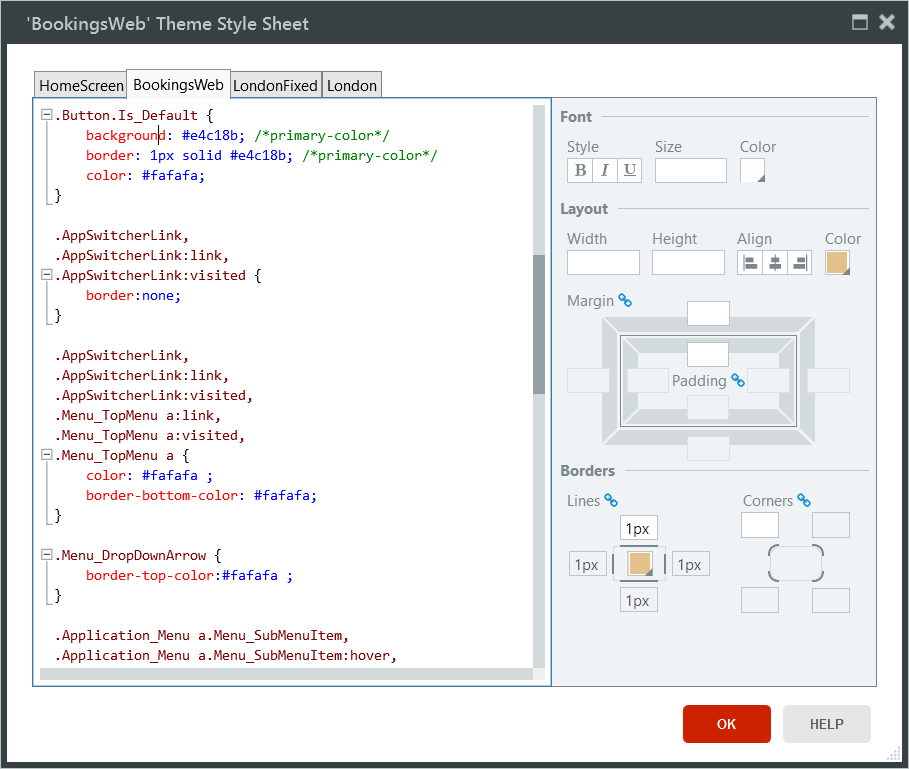
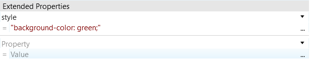
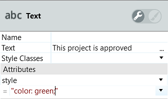

# Cascading Style Sheets (CSS)

Cascading Style Sheets (CSS) is a language for describing how content is presented. Its purpose is help separating content (HTML) from presentation. OutSystems uses OutSystems Mobile UI Framework and OutSystems Web UI Framework that come with their own CSS. You can either add new styles or modify the existing ones by copying them from the base theme.

These elements have their own CSS which you can edit:

* [Themes](<themes.md>)
* Web Screens and Emails
* Web Blocks
* Widgets (complex widgets have more than one style)

## Applying CSS with the class attribute

You can specify classes of an element in the Properties Pane either by using the **Style Classes** or by using the **Extended Properties** and setting the `Property` field as `class`.

To specify static classes using **Style Classes**:

* In Web Applications insert the class names without quotes and separated by a space (`bold red`)
* In Mobile Applications insert the class names with quotes and separated by a space (`"bold red"`)

To specify dynamics classes:

* In Web Applications use an Expression to define the `class` attribute in the **Extended Properties**
* In Mobile Applications use an Expression in the **Style Classes** field

## Editing CSS

CSS is edited in Style Sheet Editor. You can open it by double-clicking **Style Classes** property in Properties Pane when you edit an element that can have CSS. 

You can also open Style Sheet Editor by clicking the **CSS** button in the Main Editor toolbar. Select the tab with the application name and define or edit the style to make it available to the whole application. Alternatively, select the tab with the name of the currently selected screen or block to narrow the scope of the style to that screen or block.

## CSS specificity

Not all styles have the same priority and the order Service Studio imports the style sheets will affect how browsers will apply your styles. The last style to be applied has the highest priority.

1. System style sheet for Container widgets in the Grid.
1. (Web) Block style sheet.
1. Theme style sheet, which also includes a base theme (if specified).
1. (Web) Screen or Email style sheet.
1. Theme extra style sheet, with the Grid settings defined in the Theme properties.
1. Styles that Service Studio generates when you use Styles Editor.
1. Inline style you defined in **Extended Properties** / **Attributes**.

## Inline CSS

You create inline CSS in Web by adding `style` in the **Extended Properties** and then entering the CSS rules (for example, `"background-color: green;"`).

In Mobile, inline CSS is defined in the **Attributes** part of the properties pane.

# OutSystems Grid

OutSystems uses a high-level grid system. If you specify the number of columns in the Theme grid settings, the width of elements can be expressed in columns. In **Margin Left** you can use the `(Auto)` property to have the values calculated automatically.

# Importing CSS

Use the `@import` CSS at-rule in Style Sheet Editor to import style rules from other locations.
