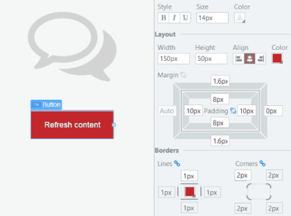

# Change the Look of Widgets with Styles Editor

Styles Editor is a panel for editing basic visual properties. Use it to change, for example, font color, margins or border thickness. In the **Interface** tab, open a screen or block, select an element and click the **Styles Editor toggle button** in the Properties Pane. Styles Editor panel is also available in **Style Sheet Editor**, where you can use the editor to modify saved styles.

To style a widget use the options in **Font**, **Layout** and **Borders**. Here is an overview of what you can change by using Styles Editor:

Font
:     Style (bold, italic, underline), size and color.

Layout
:     Width, height, alignment (left, center, right) and the background color. Margins and padding. When applicable to the selected element, Width and Margin Left properties have column count for the grid.

Borders
:     Thickness and color of the borders. Roundness of corners. 

**Margins** and **Borders** have icons to indicate how edits are applied to the widget.

| Icon  | Meaning  |
|---|---|
||The value is applied to all other related properties. |
||The value is applied to the current property only.|

All changes are applied to the current widget only.

If you want to use the same style on other widgets, save the style as a set of properties (a class). Then, add classes to widgets you want to style in their **Style Classes** section of the Styles Editor. To be able to promote a style to a class, your module needs to have a local theme.

The expandable section **Styles Properties Applied** lists all styles applied to the widget, regardless of where the styles are defined. Click a style to open Style Sheet Editor at the style definition.

You can edit [CSS](<css.md>) directly in the module [Theme](<themes.md>) for a greater control of the visual elements.

Note that Styles Editor edits can be overridden by the `style` value of the **Extended Properties**, according to the [CSS specificity](<css.md#css-specificity>) rules. Additionally, any class added in `class` extended property is not visible the editor.

# Examples of use

Here are some examples of how you can use Styles Editor to change widgets look, save styles and apply them to other widgets in the application.

## Change style of a widget

1. Drag a widget to a (Web) Screen.
1. In the **Properties Pane** click the **toggle button**.
1. In **Font** section edit text properties, for elements that contain text.
1. Use **Color** fields to open the color picker and set the color of a property.
1. Change width, height, alignment in **Layout**.
1. Adjust outer and inner spacing in **Layout/Margin** and **Layout/Padding**.
1. Add borders in the **Borders** section and adjust the roundness.

## Save a style

1. Edit a widget in Styles Editor.
1. In the section **Style Classes** (or **Styles Properties Applied**) click **Save changes to reusable class**.
1. In the dialogue that opens, enter a name for the class (for example, `myStyle`). The class groups all the elements of style.
1. In the Style Sheet Editor window that opens, press **OK**.

## Apply a saved style

1. Click the widget which you want to style.
1. In the **Style Classes** section click the **pencil icon**.
1. Add your style class to the style list, separating it by a space. For example: `BaseStyle1 BaseStyle2 myStyle`.

## Edit a saved style

1. Click a widget that has the style you want to edit.
1. In the **Style Classes** section (or in **Style Properties Applied**) click the name of the style, for example `myStyle`.
1. In the window that opens, edit the properties in the embedded **Styles Editor**.
1. Click **OK** when you finish editing.
