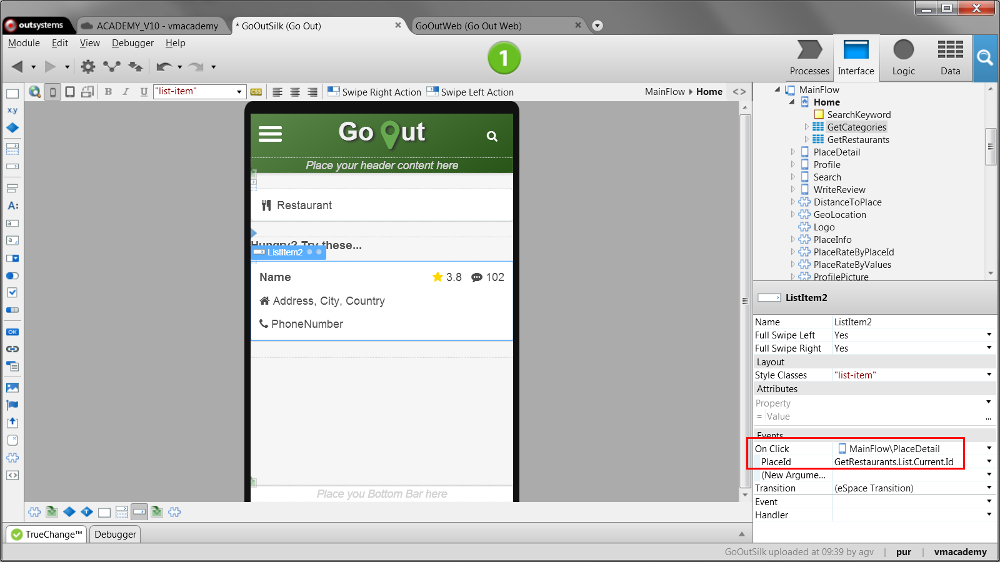
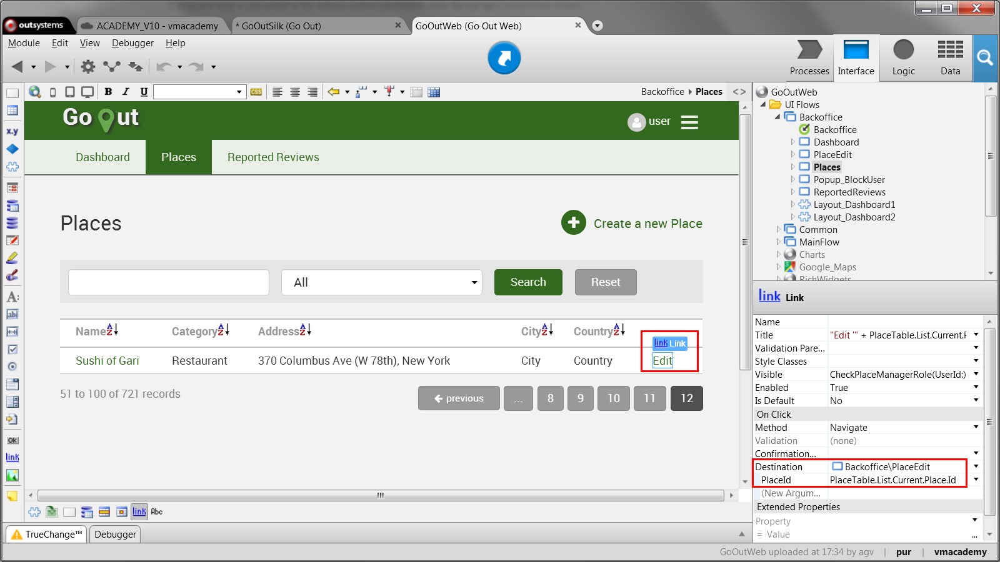

# Navigate to Another Screen

Most applications have multiple screens of content with which end-users interact. Typically you use links or buttons to provide navigation between screens to users.

A common case where you want to allow end-users to navigate between screens of an application is when you have a collection of items and you want to enable the user to pick an item and visualize the selected item’s details in a new screen.

To create such navigation on a mobile app, do the following:

  1. On the screen that displays the list, select the List Item widget; 

  2. In the properties of the List Item widget, select the target screen as handler for the On Click event and define the identifier of the current list item as an input argument to the target screen. 

To create such navigation on a web app, do the following:

  1. On the screen that displays the list, associate a Link widget with a detail of the item displayed in the list; 

  2. In the properties of the Link widget, select the target screen in the Destination property and define the identifier of the current list item as an input argument to the target screen. 

## Example in a Mobile App

In the GoOut mobile application, we have the Home screen listing places in
your location. We want to allow your end-user to navigate to the detail screen
of the place on which the user taps.

To create such navigation do the following:

  1. In the ‘Home’ screen, under the List widget, select the List item; 

  2. In the properties editor, select the Place screen as the handler for the  On Click event  and pass the Place identifier as an argument; 

  3. Publish and test. 

    

## Example in a Web App

In GoOutWeb, an application to review and rate places, there is a back office screen that lists all the places. You want to enable users to navigate to another screen where they can edit a place.

To create such navigation do the following:

  1. Open the ‘Places’ screen; 

  2. Add a new column to the table that displays the places; 

  3. Drag a Link widget from the toolbox to the cell of the new column, and type ‘Edit’ to define the text of the link. 

  4. Select the Link widget and in the properties editor set Destination to the PlaceEdit screen and PlaceId to PlaceTable.List.Current.Place.Id; 

  5. Publish and test. 

    