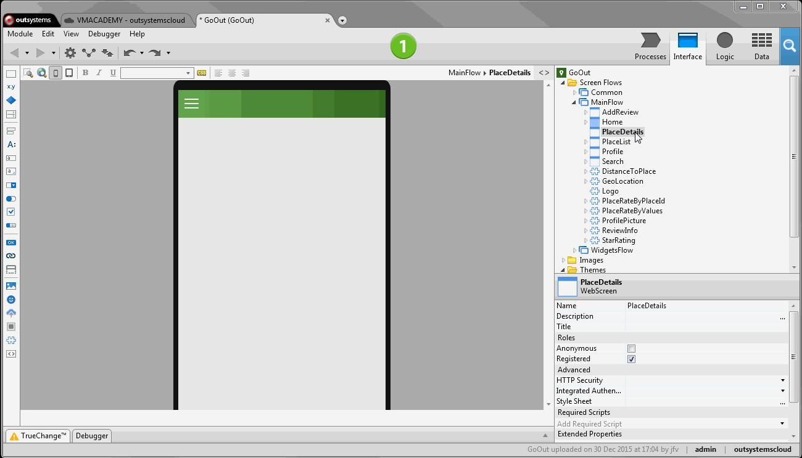

# Pass Data Between Screens With Input Parameters

Some screens must receive information that defines the data shown on that screen. Consider as an example a screen showing the profile of a user. This screen needs to receive information about which user to display. In OutSystems, we use Input Parameters to pass information between screens.

To pass information to a screen do the following:

1. Right-click the screen on the Elements Tree and choose 'Add Input Parameter'; 
2. Define the name and data type of the new input parameter; 
3. Use the input parameter to define or filter the information shown on the screen; 
4. When navigating to this screen set the value of the input parameter. 

## Example

In the GoOutWeb application, an application to find and review interesting places, we want to create a screen that shows the details of a place. To pass the place identifier to the screen we'll use an Input Parameter as follows:

1. Right-click the PlaceDetails screen and select ‘Add Input Parameter’. Rename the input parameter to PlaceId and make sure that the data type of the parameter is ‘Place Identifier’; 
2. Add an aggregate to the screen that fetches records of the Place entity; 
3. Filter the aggregate results by the Place identifier received as input parameter; 
4. Drag the aggregate to the screen. This will create the necessary labels and expressions to display the place details; 

    

5. In the Home screen, open the navigation to the PlaceDetails screen associated with the list of places displayed on the screen; 
6. Select the destination MainFlow\PlaceDetails and set the argument PlaceId to the value of the Place identifier selected by the user. 