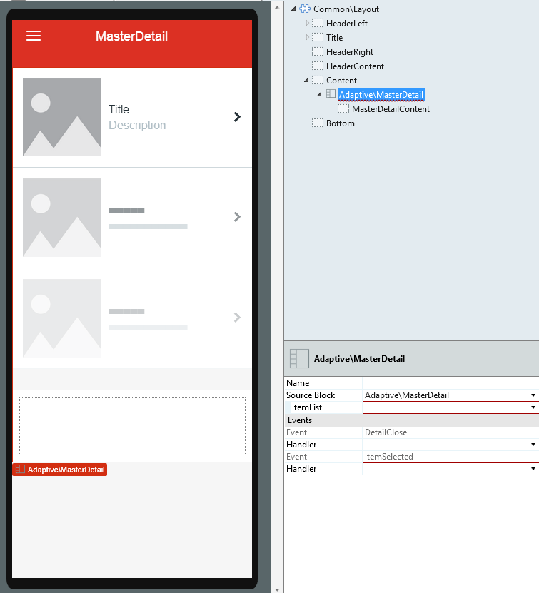
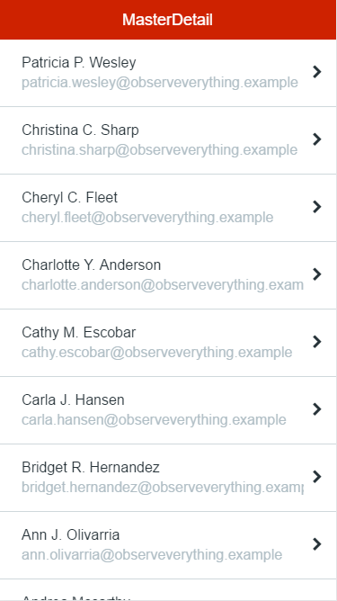

# MasterDetail Pattern

The MasterDetail pattern is similar to the SplitScreen pattern, but it receives an item list for the left panel. You can use this pattern in tablet apps, to display the detail of a list of items.

Here's the preview in the Development Environment:

## How to Use the MasterDetail Pattern

Start by binding a List to the **ItemList** parameter and leverage the Block events to change the content placeholder.

1\. Create a local boolean variable and set it on **OpenedOnPhone**.

2\. To open the detail of the clicked element, use a link for an action, set your local variable to _True_ , and add logic to open the correct detail.

3\. To close the detail, create an action and set your local variable to _False_ , and use this action in the **DetailClose** event. Add necessary logic.

### Phone Landscape with the Same Behavior as Tablet

You can have your phone in landscape to work the same way as a tablet:

    
    
    .phone.landscape .split-left {
         width: **x; /* This is width value for the left side */**
    }
    
    
    
    .phone.landscape .split-right {
         -webkit-transform: translateX(0) translateZ(0);
          transform: translateX(0) translateZ(0);
        width: **x; /* This is the width value for the right side */**
         left: auto;
        right: 0;
        border-left: 1px solid #d3d3d3;
    }
    
    
    .phone.landscape .detail-open .split-right-close {
        opacity: 0;
        pointer-events: none;
    }
    
    
    .phone.landscape .detail-open .app-menu-icon {
        opacity: 1;
        pointer-events: auto;
    }
    
    

## Input Parameters

**Input Name** |  **Description** |  **Default Value**  
---|---|---  
 ItemList  |  These are the items for the list on the left side of the MasterDetail.  |  N/A  
  
## Events

**Event Name** |  **Description** |  **Mandatory**  
---|---|---  
 DetailClose  |  Triggered when the detail (or right side of the MasterDetail) is closed.  |  _False_  
 ItemSelected  |  Triggered when an item of the list (or left side of the MasterDetail) is selected.  |  _False_  
  
## Layout and Classes

## CSS Selectors

**Element** |  **CSS Class** |  **Description**  
---|---|---  
 MasterDetail Wrapper  |  .split-screen-wrapper  |  Container that wraps elements in the left and right containers.  
 Left Content  |  .split-left  |  Add content to the left side.  
 Right Content  |  .split-right  |  Add content to the right side. In phone view, this Element is off-canvas.  
 Close Right Content  |  .split-right-close  |  
  
## Compatibility with Other Patterns

This pattern should be used alone inside the screen content because it will adapt to the height of the parent. Additionally, you should avoid using the MasterDetail pattern inside patterns with swipe events, like [Tabs](<tabs.md>).

## Samples

You can use the MasterDetail pattern as a sample:

