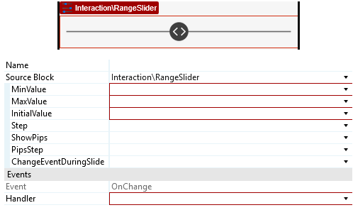
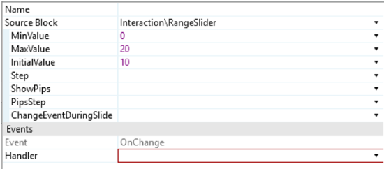
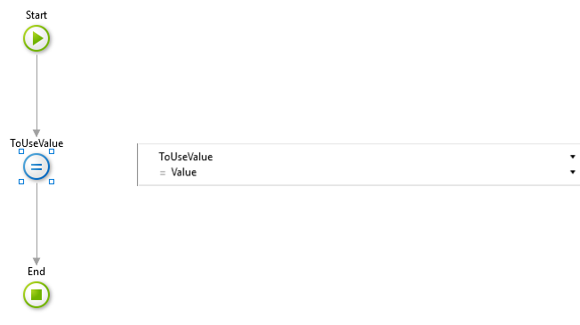
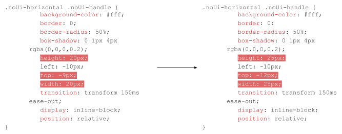
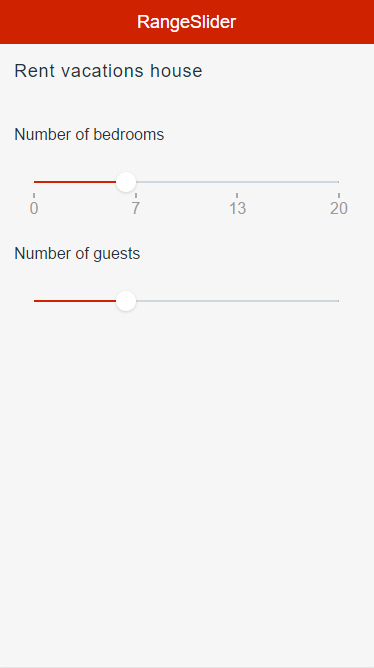

# RangeSlider Pattern

The RangeSlider pattern allows you to set a value by dragging a handle within a configured range. It is used to control a variable value with simple and interactive user input.

## How to Use the RangeSlider Pattern

Bind your variable to the **InitialValue** input and use the **OnChange** event to add your logic to handle value changes.

1\. After setting the **MinValue** , **MaxValue** and the **InitialValue** , you'll need to create the **OnChange** event.

2\. Create an integer value and assign it.

**Result**:

### Changing the Color of the Bar

### Changing the Size of the Handles

## Input Parameters

**Input Name** |  **Description** |  **Default Value**  
---|---|---  
 MinValue  |  Slider's minimum value.  |  none  
 MaxValue  |  Slider's maximum value.  |  none  
 InitialValue  |  Value selected by default. Must be between min and max values.  |  none  
 Step  |  Slider moves in increments of Step. If Step is 10, the slider will go from 0 to 10, to 20, to 30, etc.  |  1  
 ShowPips  |  Show pips below the slider.  |  True  
 PipsStep  |  Range interval after which a Pip is drawn (when ShowPips is enabled). If not specified, the component will try to guess what step fits your data.  |  -1  
 ChangeEventDuringSlide  |  Triggers Change events while the slider is being dragged. If set to _False_ , the Change events will only be triggered when the user releases the slider. **Tip**: If you're refreshing a query based on the value of the slider, you probably want to set this to _False_ .  |  True  
  
## Events

**Event Name** |  **Description** |  **Mandatory**  
---|---|---  
 OnChange  |  Action to execute after selecting a new value on the slider. Returns the new Value.  |  _True_  
  
## Layout and Classes

## CSS Selectors

**Element** |  **CSS Class** |  **Description**  
---|---|---  
 noUi-handle  |  .noUi-active  |  Class added when handle is clicked.  
  
## Samples

This sample uses the RangeSlider pattern:

