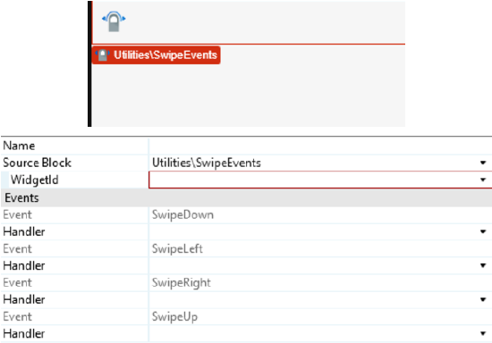
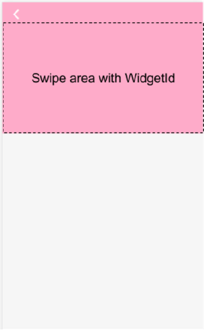
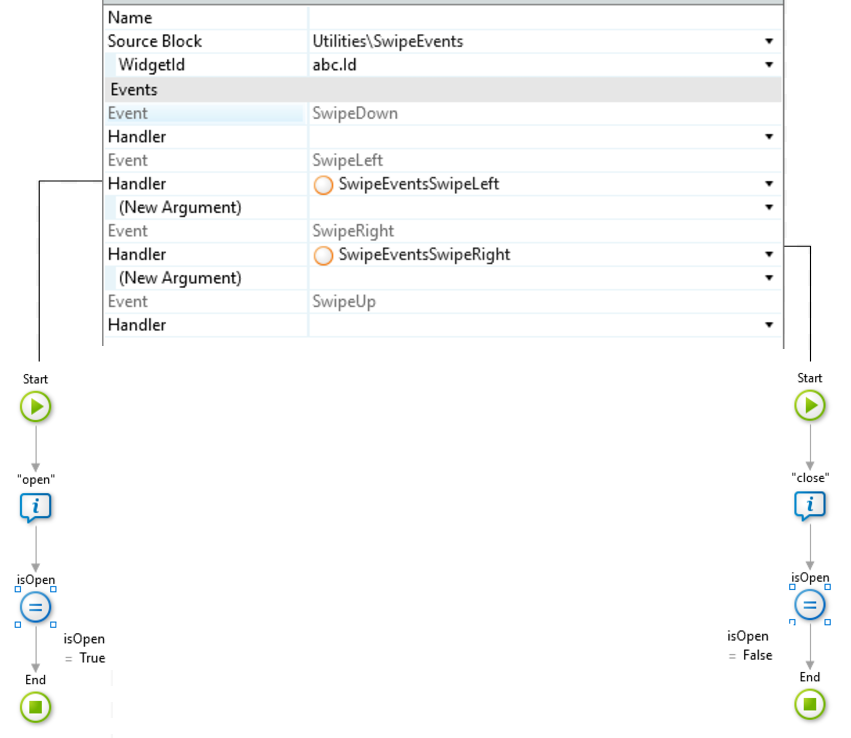

# SwipeEvents Pattern

The SwipeEvents pattern enables swiping on a specific widget.

## How to Use the SwipeEvents Pattern

You can use the SwipeEvents pattern to open a sidebar.

Create a local variable, called isOpen to be used in the sidebar.

Result:

## Input Parameters

**Input Name** |  **Description** |  **Default Value**  
---|---|---  
 |  WidgetId  |  Element that will be swipeable.  |  none  
  
## Events

**Event Name** |  **Description** |  **Mandatory**  
---|---|---  
 SwipeDown  |  The event is triggered after a swipe down.  |  _False_  
 SwipeLeft  |  The event is triggered after a swipe left.  |  _False_  
 SwipeRight  |  The event is triggered after a swipe right.  |  _False_  
 SwipeUp  |  The event is triggered after a swipe up.  |  _False_  
  
## Compatibility with other Patterns

There might be conflicts with any pattern with touch events (unless the code is altered to support his behavior). For example: using the id of a sidebar instead of a container in the previous example.

  * HorizontalScroll 
  * [Carousel](<carousel.md>)
  * [TouchEvents](<touchevents.md>)
  * [StackedCards](<stackedcards.md>)
  * Notification 
  * Sidebar 

## Samples

The following sample uses the SwipeEvents pattern:

