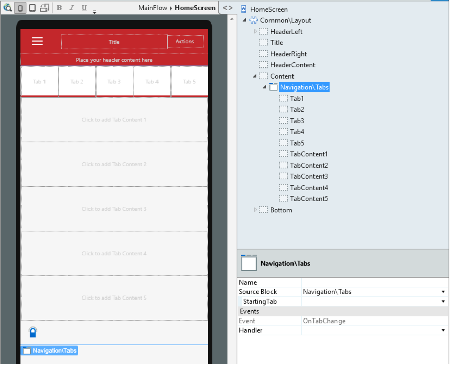
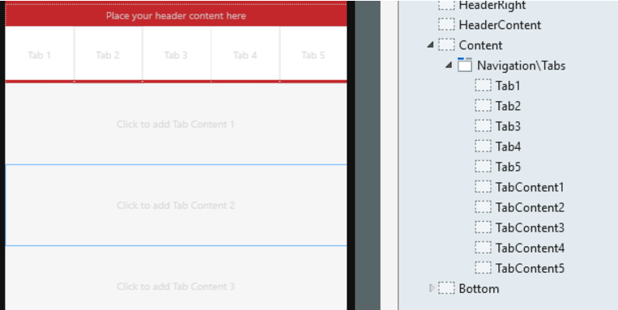
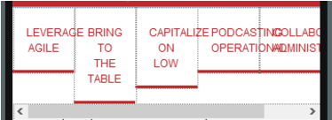
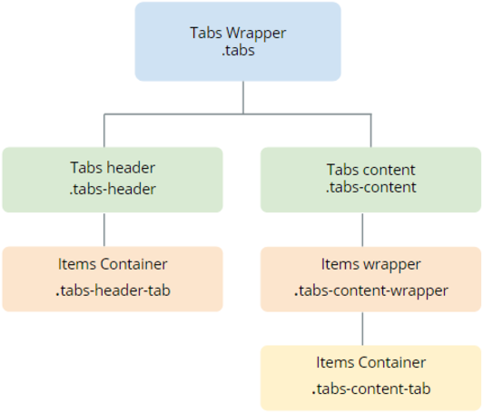

# Tabs Pattern

Set of Tabs with placeholders for Title and Content, used to display large sets of information which can be split into different areas, while always remaining a click away. Use this pattern to display large sets of information split into different areas.

Here's the preview in Service Studio:

## How to Use the Tabs Pattern

1\. Drag the Tabs pattern into your screen.

2\. Place your content inside the Placeholders.

a. The placeholders Tabs1, Tabs2, Tabs3, Tabs4 and Tabs5 represent the header tabs.

b. The other placeholders represent the content of each tab.  
c. If you only need 2 or 3 tabs and you want to hide the others, you don’t need to do anything. This pattern hides the placeholders without content.

3\. Set the **StartingTab** parameter to display the Tabs when rendering (see **Input Parameters**).

4\. Publish your app.

### Add Styles to Tabs and Content

This is an example of CSS code to change the style of selected items in Tabs:

    
    
    .tabs-header-tab {
         background-color: #ebebeb;
    }
    
    
    .tabs-header-tab.active {
        border-bottom: 3px solid #000;
        background-color: #ebebeb;
        color: #0097eb;
    }
    
    
    .tabs-content-tab {
        background-color: #ccc;
        padding: 20px;
        font-size: 18px;
        font-stretch: condensed;
    }

### Hide Tabs without Content

All Silk patterns hide _divs_ without content in the placeholder. If you only need 2 or 3 tabs and you want to hide the others, you don’t need to do anything.

## Input Parameters

**Input Name** |  **Description** |  **Default Value**  
---|---|---  
 StartingTab  |  Index of the currently active tab.  |  0  
  
## Events

**Event Name** |  **Description** |  **Mandatory**  
---|---|---  
 OnTabChange  |  Triggered when switching tabs.  |  _False_  
  
### Layout and Classes

## CSS Selectors

**Element** |  **CSS Class** |  **Description**  
---|---|---  
 Tabs Wrapper  |  .tabs  |  Container that wraps all Tabs elements.  
 Active tab header  |  .tabs-header-tab-active  |  Represents the header of the active element.  
 Open tab content  |  .tabs-content-tab-open  |  The dot that represents the content of the open item.  
  
## Device and Patterns Compatibility

Incompatibility with RTL on Android devices with 4.4.2 OS version.

Avoid using Tabs inside patterns with swipe events, like Stacked Cards or Carousel.

## Samples

The following samples use the Tabs pattern:

