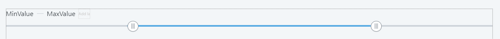
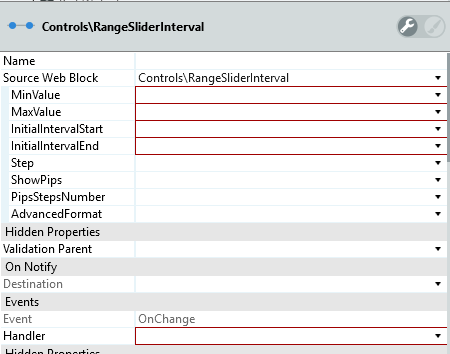
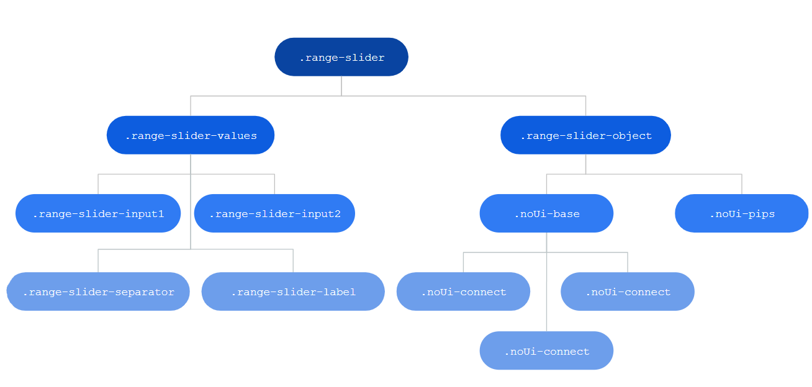
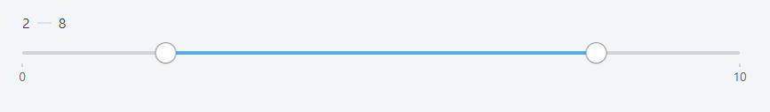

# Range Slider Interval Pattern

Select a single value or a range between two values.

**When to use**

Offer this UI control of choice for letting users select a value or range from a fixed set of options.

**How to use**

Place the range slider pattern on your screen. On the pattern properties, select the min and max range values.

1. Drag RangeSliderInterval pattern into the preview.

2. Enter the mandatory values in the properties pane.

## Input Parameters

| **Input Name** |  **Description** |  **Type** | **Mandatory** | **Default Value** |
|---|---|---|---|---|
| MinValue  |  Set lowest possible value. |  Integer | _True_ | none |
| MaxValue  |  Set highest possible value. |  Integer | _True_ | none |
| InitialValue  |  Value selected by default. Must be between min and max values. |  Integer | _False_ | 1 |
| Step  |  Increment value for each step. For instance, a step of 5 would make the slider jump across 0-5-10-15-20 and so on. The default value is 1. |  Integer | _True_ | none |
| ShowPips  |  If true, displays the range values near the slider. The default value is true. |  Boolean | _False_ | _True_ |
| PipsStepsNumber  | Set the number of Pip Steps. Only applied if ShowPips is true |  Integer | _False_ | 0 |
| AdvancedFormat  | Allow for more options beyond what it's provided through the inputs. To find more options that can be used, go to [noUiSlider library](https://refreshless.com/nouislider/ "noUiSlider library"). Example: "{ pips: { density: 1 } }" |  Text | _False_ | "{}" |

## Events

| **Event Name** |  **Description** |  **Mandatory**  |
| ---|---|--- |  
| OnChange | Event triggered once a handler is dragged and the values change.  |  _True_  |

**Return Values**

* SelectedMinValue: Integer
* SelectedMaxValue: Integer
  
## Layout and Classes

## CSS Selectors

| **Element** |  **CSS Class** |  **Description**  |
| ---|---|---  
| Lesser handle |  .noUi-handle-lower |  It's the lesser handle, used to customize (use also the :before and :after).  |
| Upper Handle  |  .noUi-handle-upper  |  It's the upper handle, used to customize (use also the :before and :after). |
| Interval  |  .noUi-connect  |  Used to change the color of the interval  |
  
## Examples in Screen Templates

The following Screen Templates use the this pattern:

   * CardList
   * FourColumnGallery
   * ThreeColumnGallery
   * TwoColumnGallery

## Advanced Use Case

Here are some examples of more advanced settings for the pattern.

### Change Interval Color

`.range-slider .noUi-connect {
background: yourcolor;
}`

Or using CSS variables: `var(--color-yourcolor)`
example:
`.range-slider .noUi-connect {
background: var(--color-red);
}`

Make sure to check which colors are available.

### Removing the || of the handlers

1. Create a class `.range-slider .noUi-handle:before, .range-slider .noUi-handle:after` 
2. Set the content to `height: 0px`
3. Publish the application.

