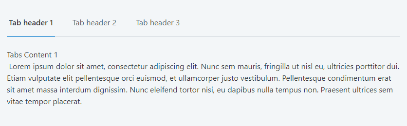
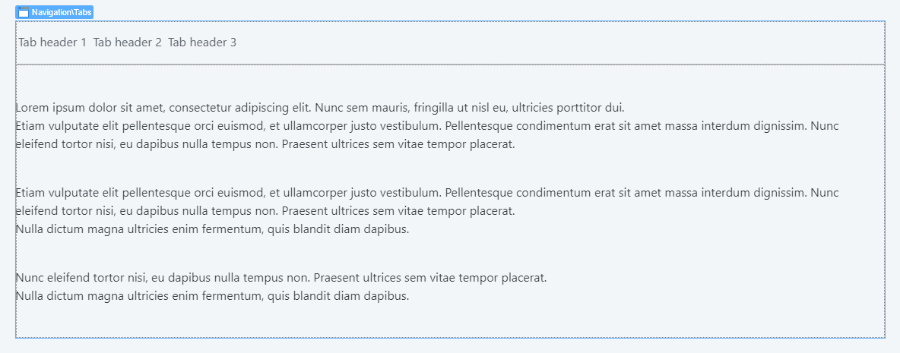
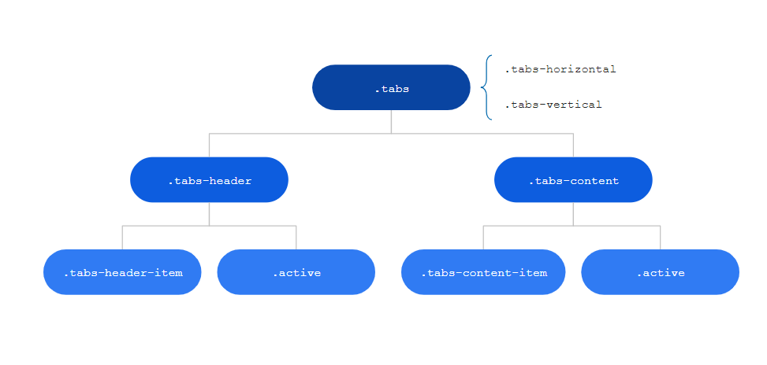
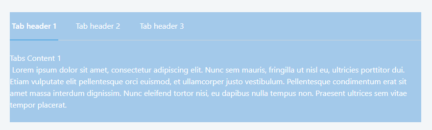

# Tabs Pattern

Use this pattern to display large sets of information which can be split into different areas, while always a click away. The headers can have other widgets, like counters, badges or icons.

**When to use**

Use the Tabs pattern when you need to separate content into sections with a flat structure. However, avoid using it in large forms.

**How to use**

Fill in the placeholders Header and Content with the Blocks TabsHeaderItem and TabsContentItem, respectively. Use any number of these as you need. In the parameters, specify the initial active tab, along with the Tabs orientation and justification. 

1. Drag Tabs pattern into the preview.

2. Set your content and publish.

## Input Parameters

### Tabs
| **Input Name** |  **Description** |  **Type** | **Mandatory** | **Default Value** |
|---|---|---|---|---|
| ActiveTab  |  Set the Active Tab |  Text | _False_ | none |
| Orientation  |  If Vertical header will be displayed side by side to the content, if Horizontal, header will be displayed above content |  Orientation Identifier | _False_ | Entities.Orientation.Horizontal |
| IsJustified  |  The Tabs Header items are evenly distributed in the line, first item is on the start and last item on the end |  Boolean | _False_ | 1 |
| IsRight  |  Align the Tabs Header items to right. This will only go into effect if the Orientation parameter is set to Vertical |  Boolean | _False_ | _False_ |
| ExtendedClass  |  Add custom style classes to the Tabs Block |  Text | _False_ | none |

### TabsHeaderItem
| **Input Name** |  **Description** |  **Type** | **Mandatory** | **Default Value** |
|---|---|---|---|---|
| DataTab  |  Sets the name to connect to the TabsContentItem. Should be the same as the paired HeaderItem and unique |  Text | _True_ | none |

### TabsContentItem
| **Input Name** |  **Description** |  **Type** | **Mandatory** | **Default Value** |
|---|---|---|---|---|
| DataTab  |  Value that will connect with the TabsHeaderItem. Should be the same as the paired ContentItem and unique |  Text | _True_ | none |

## Layout and Classes

## CSS Selectors

| **Element** |  **CSS Class** |  **Description**  |
| ---|---|---  
| Active Header |  .tabs-header-item.active |  It's active header (represented as the one with a colored underline)  |
| Active Tab  |  .tabs-content-item.active  |   It's active content  |
  

## Advanced Use

### Change Active Header Style

Write the following CSS in the CSS editor and change the `yourcolor`
`.tabs-header-item.active {
    border-bottom: var( --border-size-m) solid yourcolor;
}`

Or using CSS variables: `var(--color-yourcolor)`
example:
`.tabs-header-item.active {
background: border-bottom: var( --border-size-m) solid var(--color-red)
}`

Make sure to check which colors are available.

### Add a background color to the tabs
1. Enclose the tabs with a container
2. Add the classes `background-blue-lighter text-neutral-0`, this will add a light blue background and force the text to be white
3. Publish the application.

