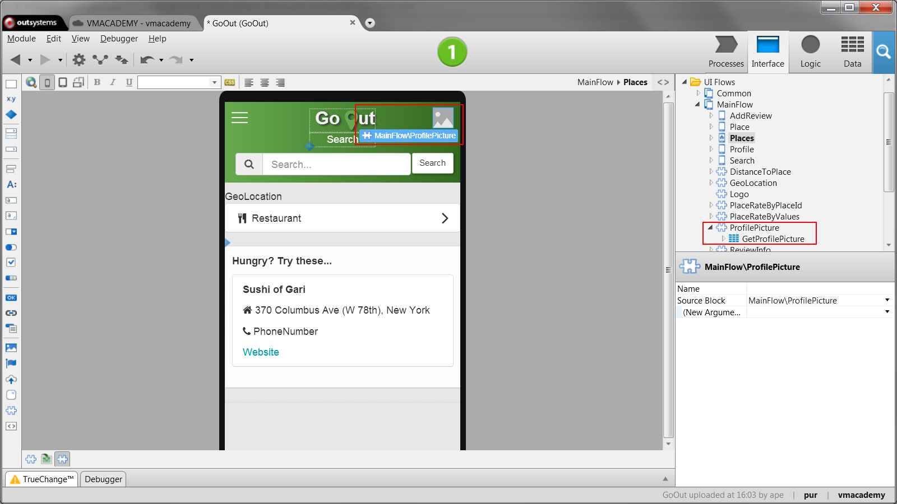

# Create and Reuse Screen Blocks

When you want to display the same content on several screens, you can define reusable screen blocks with that content. OutSystems enables you to create reusable screen content by developing **Blocks** (if on a mobile app) or **Web
Blocks** (if on a web app).

Blocks allow you to have the implementation of the screen content in just one place, meaning that changes to that content are automatically reflected on every screen that uses the blocks.

To create and use a block:

1. In a UI Flow, add a Block (if on a mobile app) or a Web Block (if on a web app); 
2. Implement the user interface and logic in the new block; 
3. In the screens where you want to use the block, drag the new block from the Elements Tree to the screen. 

## Example

In the GoOut application, an application to find and review interesting places, we want to add the profile picture of the current user to the top right-hand corner of every screen. To do this, we will create a Block and then use the Block on each screen.

Create the Block as follows:

1. Right-click MainFlow and select ‘Add Block’ to create a new Block called ProfilePicture;
2. Right-click the new Block and select ‘Fetch Data from Database’ to add an aggregate that fetches the Profile for the user currently using the app; 
3. Open the Block and add a new image widget to the screen. Set the Image Type to ‘Binary Data’ and the Image Content to the  Profile.Photo  attribute obtained by the aggregate. Set the Width of the image to 28px;
4. Link the image to the screen Profile. 

Reuse the ProfilePicture block on each screen as follows:

1. Open a screen;
2. Drag and drop the ProfilePicture block from the Elements Tree to the top right-hand corner of the screen. 

Each screen that uses the ProfilePicture block will display the profile photo of the user currently using the application on the top right-hand corner of the screen.

