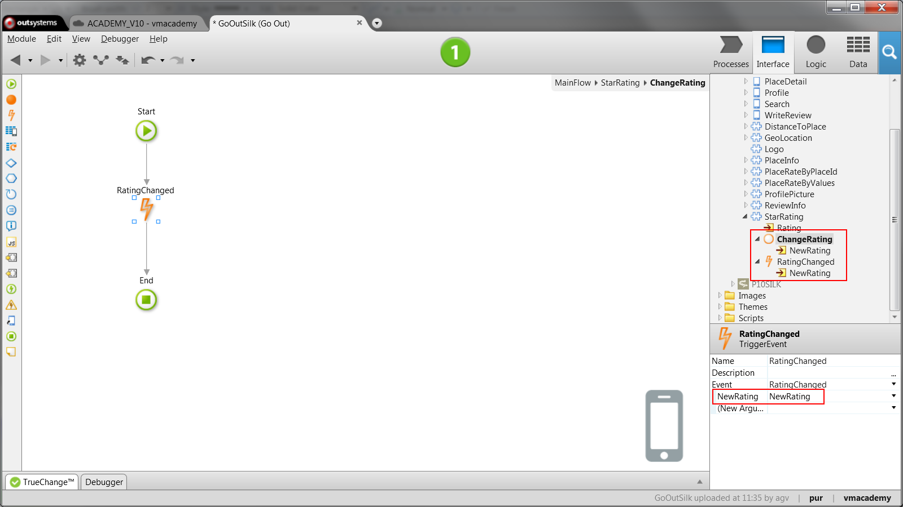
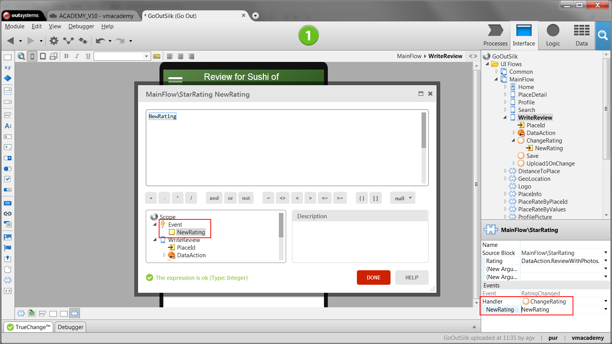

# Propagate Changes From a Block to the Parent

When a reusable screen element is used, its parent may want to react to interactions happening on it. In OutSystems, blocks can define events that trigger event handlers on its parent element, the screen or block where it is instantiated. The event handlers include logic to react to the interactions of the end-users.

To propagate changes from a block to its parent:

1. In the Elements tree, right-click on the block and add an event. When used, this event will raise the notification to the block's parent; 

2. If needed, add input parameters to the event that will we be sent with the notification; 

3. Use the event, available under the block elements tree, in the action from where you want to propagate the change; 

4. In the parent that will handle the notification, open it and select the block. In the properties pane, go to the Events section and set the event handler property to the action that will catch the notification; 

5. If you have any value sent by the event, add an input parameter to this action and assign to it the value from the event. 

## Example

In the GoOut application, an application to review and rate places, end-users
can rate places with 1 to 5 stars. We have created a block, called StarRating,
that shows the rating. We want to change it to allow tapping on the stars to
rate.

1. Open the StarRating block; 

2. On the Interface tab, right-click on the StarRating block and add an event called RatingChanged with an input parameter NewRating of type Integer; 

3. Add a new client action to the block called ChangeRating with an input parameter NewRating of type Integer; 

4. Open the new action, drag a Trigger Event from the toolbox to the action flow, and select the event RatingChanged. Set the input parameter NewRating of the event to the input parameter NewRating of the action; 

    

5. Open the WriteReview screen. This screen is used to submit a review to a place and uses the StarRating block to rate a Place in the review; 

6. Create an action on the screen called ChangeRating, with an input parameter NewRating of type Integer; 

7. Select the StarRating block on the screen, set the property Event RatingChanged Handler to the action ChangeRating, and the input parameter NewRating to the input parameter of the event. This sets the action ChangeRating as the handler of the event RatingChanged; 

    

8. In the action ChangeRating, change the classification of the review to the new rating received through the event; 

9. Publish and test the application. 
