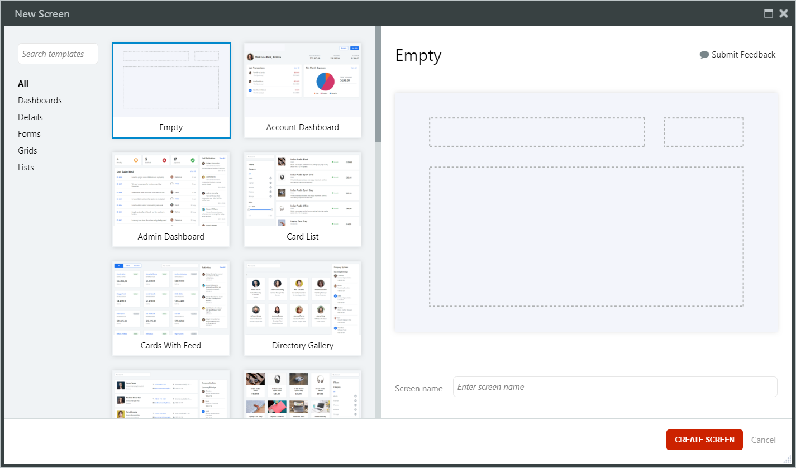
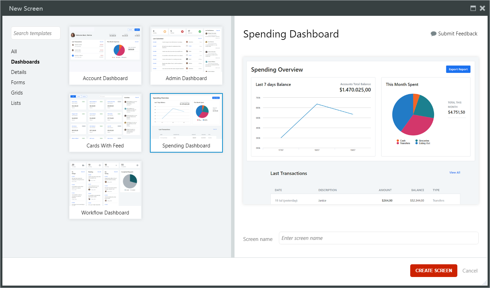

# Screen

The screen is an interface element that contains other elements for user interaction. There are two types of screens in OutSystems applications, depending on the platform:

* **Web Screen** - corresponds, in the context of OutSystems web runtime, to one web page 
* **Screen** - corresponds, in the context of OutSystems mobile runtime, to one mobile app screen

You can create a screen in the **New Screen** window. A screen can be based on a blank template, or a [screen template](<screen-templates.md>) created for specific use cases.

When you create a screen that's based on a Template Screen, it contains sample data and the associated logic. You should replace the sample data, either manually or semi-automatically. You can also edit the [sample data](<sample-data.md>) globally, so it only contains data that's relevant to your development and demo purposes.

Regardless of the platform, the screen interfaces are grouped into **UI Flows** of the **Interface** tab. An application created from one of the default application templates contains the default **MainFlow** UI flow.

## Create an empty screen

Follow these steps to create a blank screen.

1. On the **Interface** tab, locate **UI Flows**, and in it **MainFlow**. Right-click **MainFlow** and click **Add Screen** (in Mobile) or **Add Web Screen** (in Web). The **New Screen** window opens.
2. Select **Empty** in the template list.
3. Click **Create Screen**.

## Create a template based screen

Follow these steps to create a new screen based on a [Screen Template](<screen-templates.md>). The resulting screen contains sample data, that you can [replace](<replace-data.md>) manually or semi-automatically.

1. On the **Interface** tab, locate **UI Flows**, and in it **MainFlow**. Right-click **MainFlow** and click **Add Screen** (in Mobile) or **Add Web Screen** (in Web). The **New Screen** window opens.
2. Use the left side of the **New Screen** window to browse or search the screens. You can search by widgets, use cases, and meta data.
3. Select a screen template by clicking on the thumbnail.
4. Enter a title for the screen in the **Screen name** field.
5. Click **Create Screen**.

