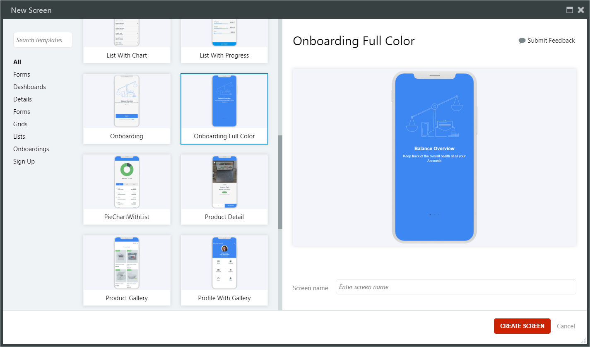

# Screen Templates

Screen Templates enable you to create [Screens](intro.md) with predefined layouts, widgets, components, styles, and logic. A screen created from a Template Screen can be published immediately and shown as a part of a demo.

Template based screens have [sample data](<sample-data.md>) that can be replaced manually or semi-automatically. The sample data enables you to understand the logic within the template.

Screen Templates significantly increase the development speed. For example, you can create the _Work Order List_ screen and then adapt it to a screen that shows the statuses of your project tasks. Change _WorkOrderItem_ to _ProjectTaskItem_, you can do this by [dragging and dropping](<replace-data.md>) the corresponding entity over the widget in the template based screen. This changes the data sources and updates the user interface.

Screen Templates are built on top of the OutSystems UI framework. For a module and a Screen Template to be compatible, the Theme of the module must be compatible with the OutSystems UI framework Theme.

