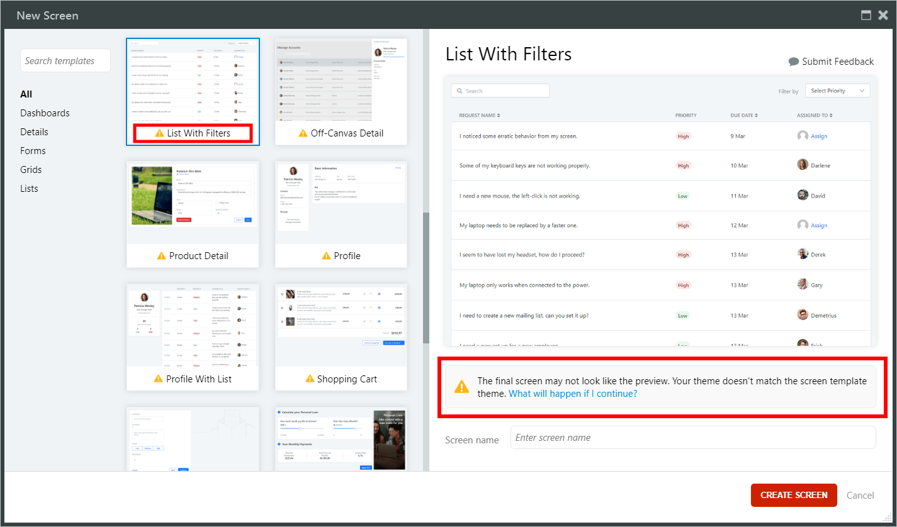

# Compatibility of Screen Templates and modules

When working with [Screen Templates](<intro.md>) you may see the following warning message: **The final screen may not look like the preview. Your theme does not match the screen template theme.** This means that your module and Screen Template are not compatible, which may cause the final page not to display correctly. 

To be able to create a screen with a built-in Screen Template, use one of the built-in [Application Templates](<../../application-templates/intro.md>) that are based on OutSystems Mobile UI or OutSystems Web UI:

* For a web application: **Side Menu**, **Top Menu**
* For a mobile app: **Phone**, **Tablet**, **Universal**

For the Screen Template to function correctly, the Theme in the Screen Template and in the module must match. If Service Studio detects a different Theme, the warning is shown. You can still continue with the creation of the screen, but the styles and widgets may not be properly rendered by the browser because of the missing CSS classes.

Screen templates are built on top of the OutSystems UI frameworks and require a matching Theme structure. Applications created from the application templates based on older OutSystems UI frameworks do not benefit from the built-in Screen Templates in OutSystems 11:

* The Silk UI framework Application Templates, and the derivative **Lisbon**, **Dublin**, **Liverpool**, **Vanilla**, and **Website**
* The London Theme based Application Template, **Web Application**
