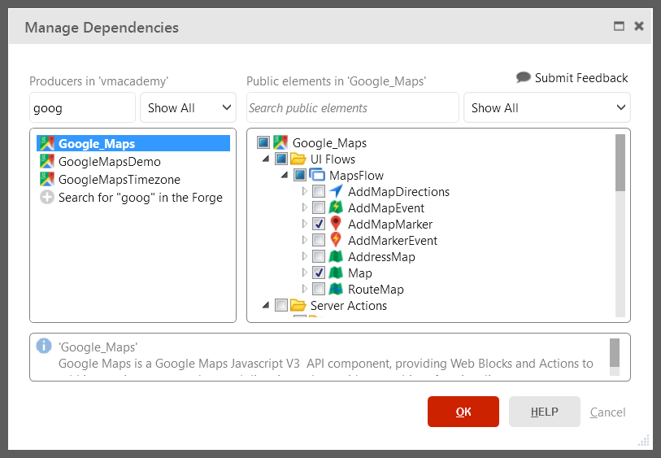

# Use a Forge Component Made by the Community

OutSystems Forge is a repository of open-source reusable projects that speed application delivery. These projects can be applications or modules and they provide multiple additional features and components such as:

* String manipulation libraries;
* Widgets to display maps or charts;
* Connectors to integrate with external services such as Box, LinkedIn, or Twitter;
* Or even entire business applications such as Timesheets, Expenses, or Sales, to customize and give a head start.

To install a project as a dependency of your application, do the following:

1. Go to <http://www.outsystems.com/home/>;
2. Click on **Create App**;
3. Click on the **Install Application** button;
4. Search for the component, select the component and click **Install**;
5. After installing the component, from the detail screen of your application, click on **Add Dependency**;
6. On the Manage Dependencies window, find the list of installed projects you can add as a dependency on left window pane. For each selected item you can see a list of its public elements on the right window pane; you can check or uncheck the elements of the project you want to use in your module. In both lists, projects and project elements, you can use filters or keyword search to help you find items and verify its status regarding usage.

In the case of installing an entire application, open it and customize it to suit your needs.

## Example

GoOutWeb is an application to review and rate places pinpointed on a map. To implement that feature, we will use the Google Maps component available on Forge.

To install the Google maps component:

1. Go to <http://www.outsystems.com/home/>;
2. Click on **Create App**;
3. Click on the **Install Application** button;
4. Search for Google Maps, select the component and click **Install...**;
5. From the GoOutWeb detail screen, click on **Add Dependency**;
6. In the Manage Dependencies window, search for the Google Maps component in the left pane and select the component;
7. On the right pane, under the UI Flows folder, check the Map and AddMapMarker blocks to add them as dependencies of your application and click OK;  

8. In the **Interface** tab, expand the Google Maps component;
9. Drag the Map block next to the form on the screen and set the Name property to GoogleMap. Now that the block has a name you can reference the block or its properties;
10. Drag the AddMapMarker widget component next to the map;
11. Set the MapId property to `GoogleMap.Id`;
12. Set the Address property to `PlaceForm.Record.Place.Address`;
13. Publish and test your application.
