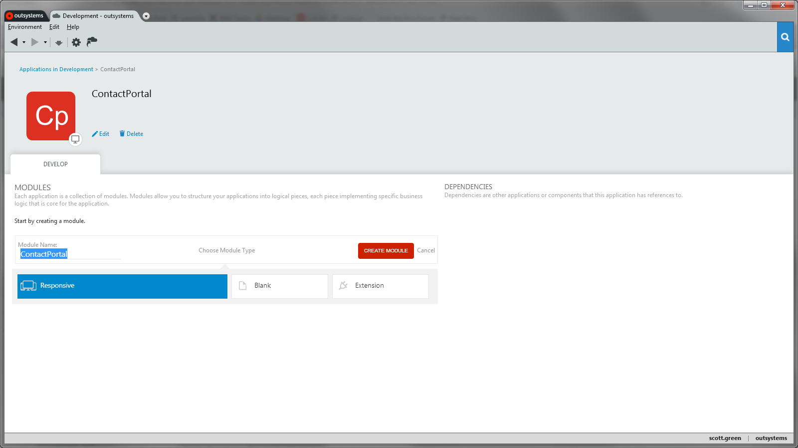
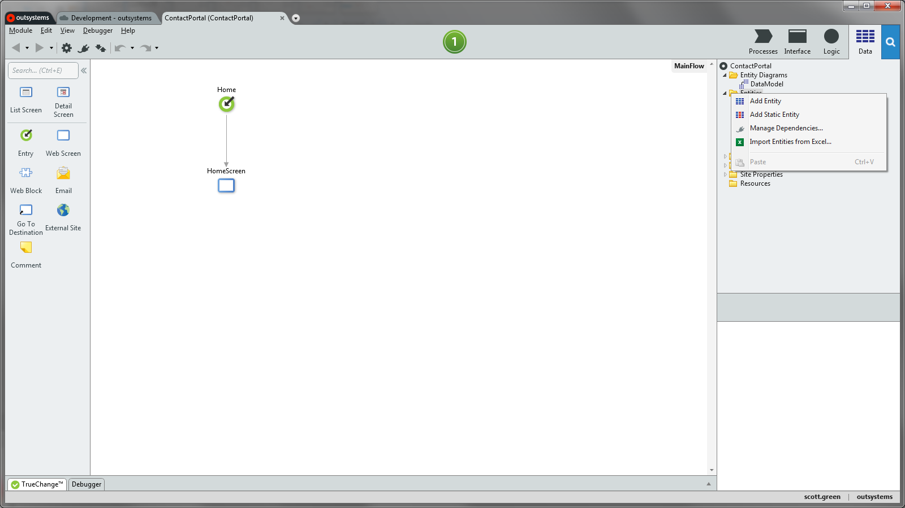
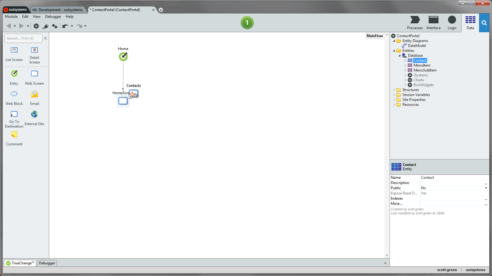
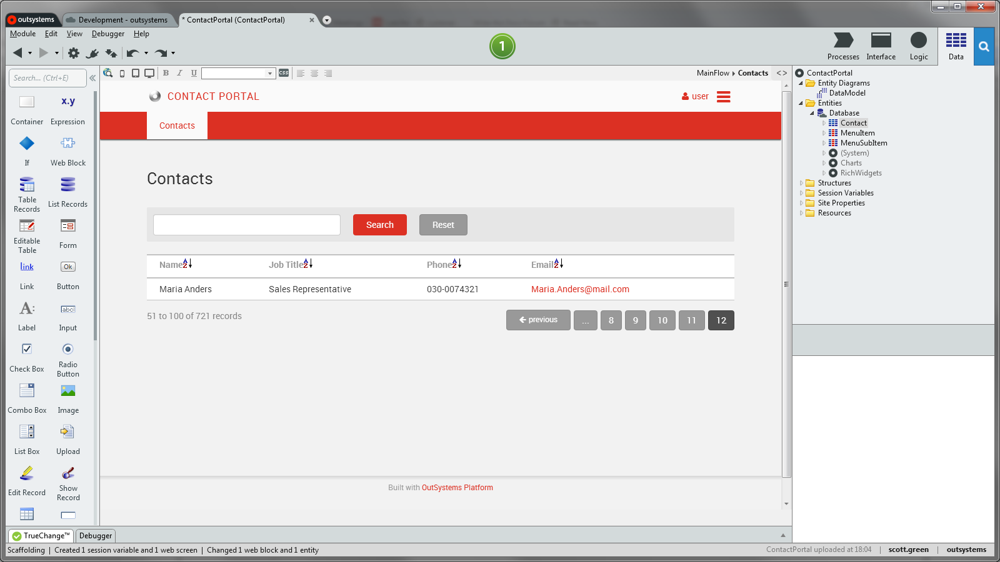
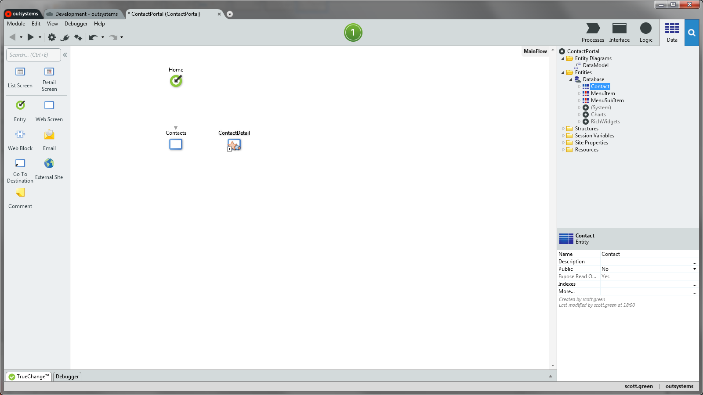
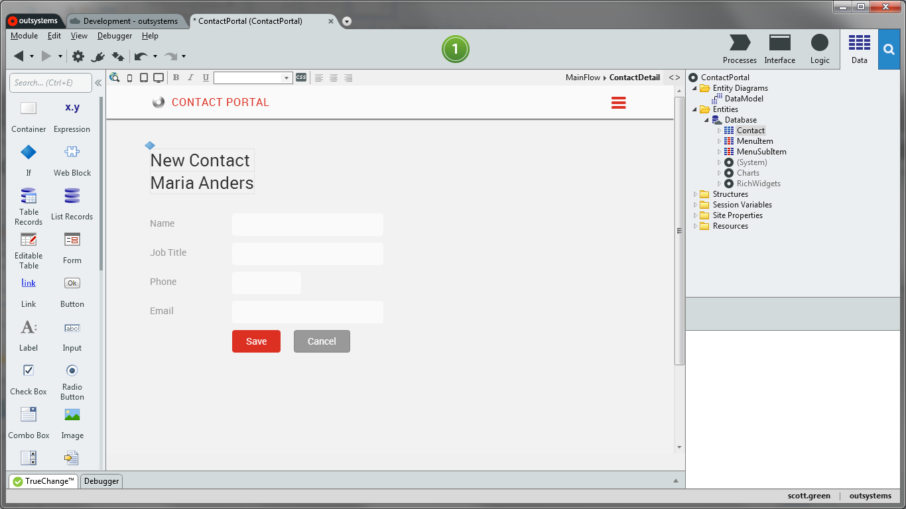
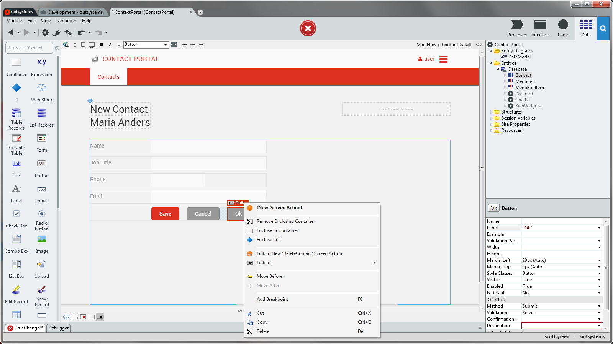
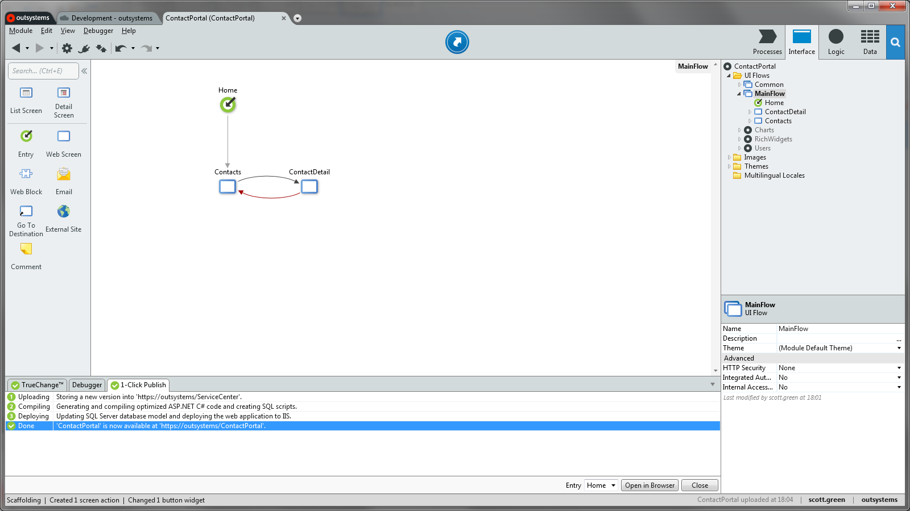

# Create Your First Web App

Developing web apps with OutSystems is straightforward. If you have an Excel file containing your data, you can import it into a database and quickly create an enterprise-grade application to manage your data. Don't worry if you don't have an Excel file ready, we provide a sample file for you.

To create an application with data that's imported from an Excel file, you need to:

  1. Create a database model, and import the data from the Excel file into the database;
  2. Create a screen that lists the data from the database;
  3. Create a screen that allows creating new records, and updating existing ones;
  4. Implement functionality to delete records from the database;
  5. Publish your application.

Let's do this! In this example we'll use a provided Excel file with contact information, and we'll create a simple contact management application.

## Create a Web App

Let's create a new contact information management web app. An application contains one or more modules, different parts of the application can be encapsulated in a module . A module is where you design the data model, implement the logic, and design the UI of your applications.

In the Development Environment, create a new web app called ContactPortal and then create a new module for the application.

## Create a Database Table from an Excel File

OutSystems stores your application data in a relational database. This means that the first step in creating an application is defining the data model.

To do this in our example we'll use a sample Excel file that already contains the following contact information:

  * Name;
  * Job title;
  * Phone;
  * Email.

In the Development Environment, open the Data tab on the top right-hand corner, right-click the Entities folder, choose **Import Entities from Excel...**, and select the sample file `Contacts.xlsx` available by default in the directory `C:\Program Files\OutSystems\Development Environment 11.0\Service Studio\TutorialResources`.

When importing an Excel file, OutSystems creates a database table (called an Entity in OutSystems) with the necessary columns (called Attributes in OutSystems) to store the data in the database.

Behind the scenes, OutSystems also creates logic to import each row in the Excel file into a database record. After publishing your application that logic runs automatically, and you populate your database with the data that is in the Excel file.

## Create a Screen to List Contacts

Now that we have contacts stored on the database, we can create a screen that lists all of the contacts.

Open the Interface tab on the top right-hand corner, and double-click MainFlow under UI Flows. Then, drag and drop the entity Contact from the Data tab to HomeScreen in the Main Editor window.

This updates the HomeScreen to include a list that displays 50 contacts at a time, along with pagination and search functionality.

## Create a Screen to Create and Edit Contacts

Creating a screen to create and edit records is as fast as creating a list screen.

Drag and drop the entity Contact from the Data tab to an empty area in the Main Editor window.

This creates a new screen with a form to create new records or edit existing ones. OutSystems also adds the server-side logic to create and edit records automatically.

## Allow Deleting Contacts

To implement an application to manage contacts we are just missing the delete functionality. Let's implement that!

Double-click the screen ContactDetail to open it. Drag and drop a Button widget from the toolbox to the right of the Cancel button of the screen, right-click the new button and choose Link to New 'DeleteContact' Screen Action.

OutSystems adds server-side logic to delete the contact record and associates the button to that logic.

## Publish Your Web App

Now we just need to make the application go live. Click the  1-Click Publish button to publish the application to your environment.

When the application is deployed, click the  Open in Browser button to test your application in a browser.
