# Service Studio Tips and Tricks

<pre class="script-css">
.mt-section h1 {
    border-bottom: solid #ddd 1px;
}
.mt-section {
    margin-bottom: 80px;
}
.mt-content-container img{
    margin-left: 2%;
    image-rendering: -moz-crisp-edges; /* Firefox */ 
    image-rendering:   -o-crisp-edges; /* Opera */ 
    image-rendering: -webkit-optimize-contrast; /* Webkit (non-standard naming) */ 
    image-rendering: crisp-edges; 
    -ms-interpolation-mode: nearest-neighbor; /* IE (non-standard property) */
}
.keyboard {
    font-size: 12px;
    color: #555;
    display: inline-block;
    padding: 0 8px;
    text-align: center;
    background-color: #eee;
    background-repeat: repeat-x;
    background-image: -webkit-gradient(linear, 0 0, 0 100%, from(#f5f5f5), to(#eee));
    background-image: -webkit-linear-gradient(#f5f5f5 0%, #eee 100%);
    background-image: -moz-linear-gradient(#f5f5f5 0%, #eee 100%);
    background-image: -o-linear-gradient(#f5f5f5 0%, #eee 100%);
    background-image: linear-gradient(#f5f5f5 0%, #eee 100%);
    border: 1px solid #ccc;
    -webkit-border-radius: 3px;
    -moz-border-radius: 3px;
    border-radius: 3px;
    -webkit-box-shadow: inset 0 1px 0 #fff, 0 1px 0 #ccc;
    box-shadow: inset 0 1px 0 #fff, 0 1px 0 #ccc 
}
.kbd {
    padding:0.1em 0.6em;
    border:1px solid #ccc;
    font-size:11px;
    font-family:Arial,Helvetica,sans-serif;
    background-color:#f7f7f7;
    color:#333;
    -moz-box-shadow:0 1px 0px rgba(0, 0, 0, 0.2),0 0 0 2px #ffffff inset;
    -webkit-box-shadow:0 1px 0px rgba(0, 0, 0, 0.2),0 0 0 2px #ffffff inset;
    box-shadow:0 1px 0px rgba(0, 0, 0, 0.2),0 0 0 2px #ffffff inset;
    -moz-border-radius:3px;
    -webkit-border-radius:3px;
    border-radius:3px;
    display:inline-block;
    margin:0 0.1em;
    text-shadow:0 1px 0 #fff;
    line-height:1.4;
    white-space:nowrap;
}
#title {
    max-width: 100%;
    height: auto;
    border-bottom: hidden !important;
}
<!--#mt-toc-container {
    color: #788 !important;
    background: #ffffff !important;
    border-style: none !important;
}    
nav > ol > li > a {
    font-weight: bold;
    font-size: 1.2em;
}
li::before, #mt-toc-container>.mt-summary-toggle {
    display:none !important;
}-->
.mouse {
  position: relative;
  box-sizing: border-box;
  margin: 0px 15px 0px 5px;
  top: -16px;
  display: inline-block;
  transform: scale(.35);
  -ms-transform: scale(.35);
  -moz-transform: scale(.35);
  -webkit-transform: scale(.35);
}
.butt{
  position: absolute;
  height: 30px;
  Width: 20px;
  border: 2px solid grey;
  box-sizing: border-box;
  background-color: grey;
  border-top-left-radius: 16px;
  -moz-border-top-left-radius: 16px;
  -webkit-border-top-left-radius: 16px;
}

.r.butt {
  transform: scaleX(-1);
  -ms-transform: scaleX(-1);
  -moz-transform: scaleX(-1);
  -webkit-transform: scaleX(-1);
  left: 21px;
}
.body {
  position: absolute;
  height: 71px;
  Width: 41px;
  border: 2px solid grey;
  border-radius: 20px 20px 25px 25px;
  -moz-border-radius: 20px 20px 25px 25px;
  -webkit-border-radius: 20px 20px 25px 25px; 
  box-sizing: border-box;
}
.c1, .c2, .c3{
  position: absolute;
  height: 8px;
  width: 3px;
  left: 8px;
  top: -14px;
  background-color: grey;
}
.c2 {
  transform: rotate(-45deg);
  -ms-transform: rotate(-45deg);
  -moz-transform: rotate(-45deg);
  -webkit-transform: rotate(-45deg);
  left: -6px;
  top: -8px;
}
.c3 {
  transform: rotate(-90deg);
  -ms-transform: rotate(-90deg);
  -moz-transform: rotate(-90deg);
  -webkit-transform: rotate(-90deg);
  left: -12px;
  top: 6px;
}
</pre>

<pre class="script-jem">
$("#title").html("&lt;img src='/@api/deki/files/10843/tt-banner.png'&gt;")
$(function() {
    $(".lclick").each(function(){
        $(this).html("&lt;div class='mouse'&gt; &lt;div class='l butt'&gt; &lt;div class='c1'&gt;&lt;/div&gt; &lt;div class='c2'&gt;&lt;/div&gt; &lt;div class='c3'&gt;&lt;/div&gt; &lt;/div&gt; &lt;div class='body'&gt;&lt;/div&gt; &lt;/div&gt;")
    });
    $(".rclick").each(function(){
        $(this).html("&lt;div class='mouse'&gt; &lt;div class='r butt'&gt; &lt;div class='c1'&gt;&lt;/div&gt; &lt;div class='c2'&gt;&lt;/div&gt; &lt;div class='c3'&gt;&lt;/div&gt; &lt;/div&gt; &lt;div class='body'&gt;&lt;/div&gt; &lt;/div&gt;")
    });
});
</pre>

# Basics

## Would you like to know more? Hit F1

Access relevant documentation from within Service Studio by selecting the Element/Flow/Tab and pressing  F1 .

* What is this Widget? Click the Widget and press  F1 

* What can I do in this Flow? Open the Flow and press  F1 

* How do I use the Debugger? Click the Debugger tab and press  F1 

* What usually causes this warning message?! You guessed it: Click it and press  F1 

## Keyboard shortcuts

You can check out the list of keyboard shortcuts in two ways:

* Use a shortcut for shortcuts:  Ctrl + Shift + K 

* Check [the shortcuts list](<https://success.outsystems.com/Documentation/11/Getting_Started/Service_Studio_Shortcuts>) in the documentation

[//]: # (* Print the shortcuts list)

## Open multiple files simultaneously

Whether you are opening files from your Environment or from a local source you can select several files and open them all at once.

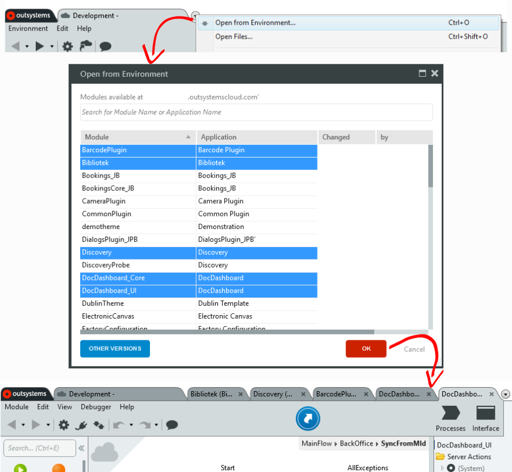

Use  Ctrl +Left-Click to add the clicked file to your selection.

Use  Shift +Left-Click to select all the files between the last file you previously selected and the clicked file.

Use  Ctrl + Shift +Left-Click to add to your previous selection all the files from the last file you previously selected to the clicked file.

[//]: # (### Use the Search)

[//]: # (### Find and Replace)

## Open a Screen in browser

To open a target Screen in a browser, open the Interface tab, right-click that Screen and choose **Open in Browser**. There is no need to create additional Entry Points.

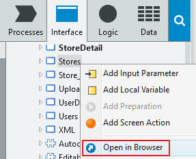

## Expanding and collapsing trees

In any of the trees, you can collapse or expand all items and subitems, by clicking  Ctrl +Left-Click in the arrow next to the item you want to expand or collapse. This way you can keep your development environment neat and tidy, “as it should be”.

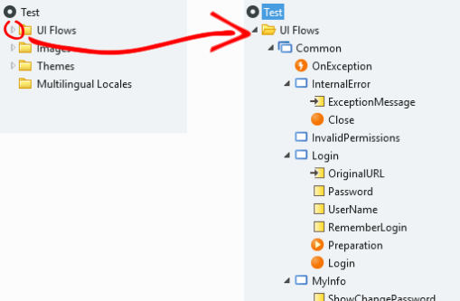

[//]: # (### Use the Widget Tree when designing UI!)

## Edit basic CSS properties with Styles Editor

No more CSS stress! Use **Styles Editor** to edit basic visual properties of widgets with the aid of a visual interface.  
Use **Styles Editor** in one of two ways:

* Select a widget and click the **Styles Editor** toggle button in the **Properties Pane**.

    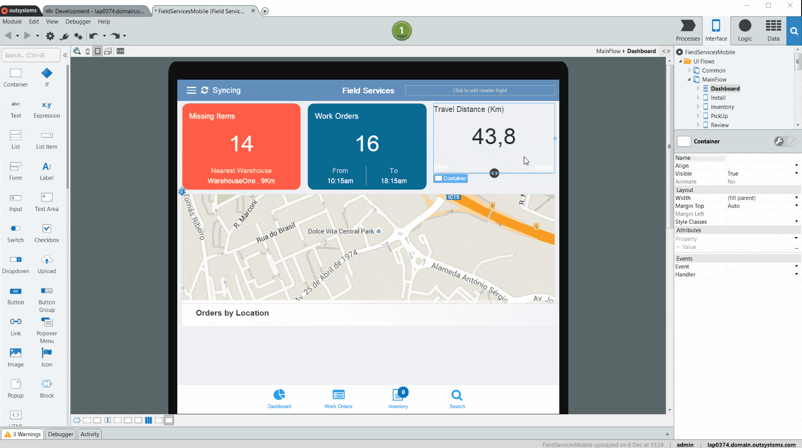

* Use it directly in the **Style Sheet Editor**!

    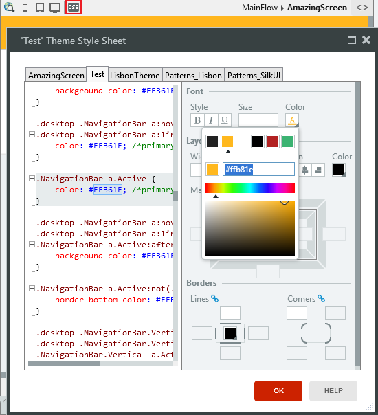

For more information check the [documentation](<https://success.outsystems.com/Documentation/11/Developing_an_Application/Design_UI/Look_and_Feel/Change_the_Look_of_Widgets_with_Styles_Editor>).

[//]: # (### Remove unused elements)

## Edit the Properties of several elements in one go

Do you need to make every Screen of a Module accessible to anonymous users?  
Do you need to change the Data Type of several Variables?

Service Studio has got your back. 
Flows, Screens, tree elements... you name it: Select the target elements, see where their Properties differ and where they share a common value, and most importantly change those Properties all at once.

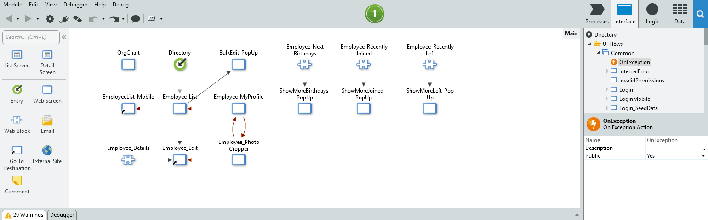

Use  Ctrl +Left-Click to add the clicked element to your selection.

Use  Shift +Left-Click to select all the elements between the last element you previously selected and the clicked element.

Use  Ctrl + Shift +Left-Click to add to your previous selection all the elements from the last element you previously selected to the clicked element.

## Easily create Entity Diagrams

Get your **Entity Diagrams** in order. 
Select the target Entities and then either drag them to an opened Entity Diagram canvas or right-click and select **Add to New Entity Diagram**.

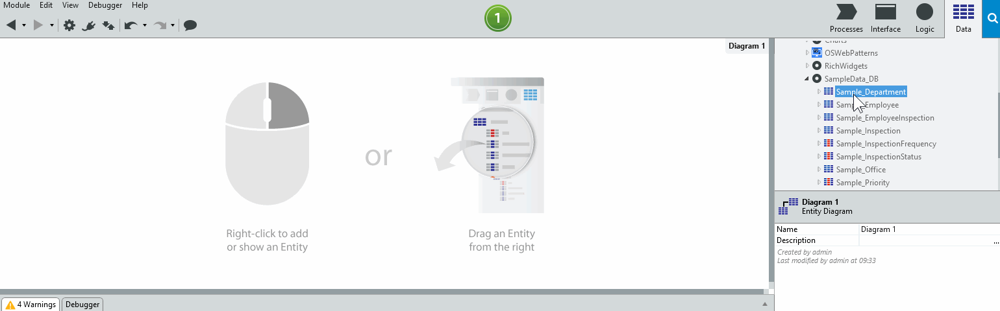

The **Entity Diagram** is automatically arranged, and if an Entity is already present in that diagram, it is not added.

# Click, click, convert

## Convert Variables

You can easily change the type of a Variable: Right-click the target Variable and select **Convert to Local Variable/Input Parameter/Output Parameter**. 

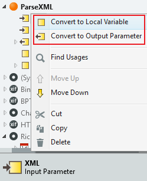

Keep in mind that not all Actions may use Output Parameters.

## Convert a Text Widget to an Expression Widget
 
 Want to convert that Text into an Expression?
 Right-click the target Text Widget and select **Convert to Expression**.
    
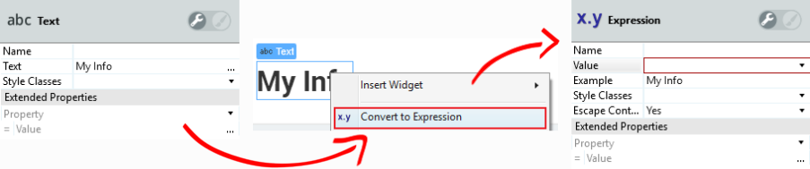

The original text from the Text widget will be automatically included as the example of the new Expression widget.

## Convert Entities/Static Entities

Right-click the target Entity/Static Entity and under **Advanced** select **Convert to Static Entity/Entity**.

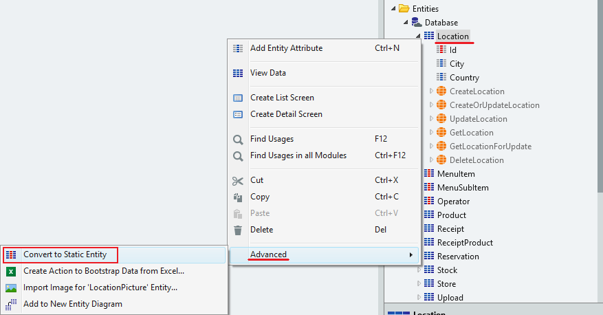

## Changing If conditions

Sometimes you need to change that True branch to a False branch and that False branch to a True branch: In a Flow, right-click the target If and select **Swap Connectors** to swap the True/False condition branches.

## Reuse logic with Extract to Action 

What can you do when your once simple and small Action becomes huge and complex?  
What should you do when you have created a reusable piece of logic inside that huge and complex Action? 

Extract that logic to a new Action: Select the target flow elements, right-click and choose **Extract to Action** to create a new Action with that logic.

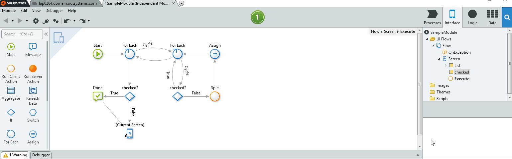

A new action will be created with the selected logic and with all the necessary Input and Output Parameters.

# Scaffolding

## Convert an Entity to a Structure 

You can convert an Entity to a Structure: Open the Data tab and drag the target Entity to the Structure Folder.

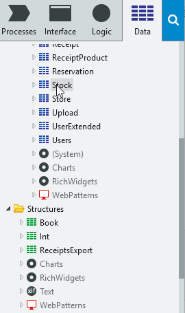

## Create an Aggregate from an Entity

Drag an Entity to an Action Flow to create an aggregate.

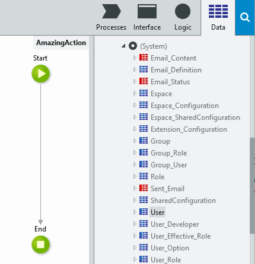

If the target Entity has an `Is Active Attribute` defined the new aggregate is created with a `<Entity>.IsActive = True` filter; Otherwise the new aggregate is created without filters.

[//]: # (## Creating a filtered aggregate)

 [//]: # (In any server Action flow, if you have a variable, from most of the identifier types, you can drag and drop it to the flow and it will become an aggregate already filtered by the Identifier type.)

## Create an If from a Boolean

Drag a Boolean Variable to a Flow to create an If condition.

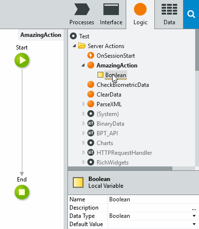

## Create an Assignment from a Variable

In a Flow, drag a Variable to an Assign element to create an `Assignment` for that Variable.
 
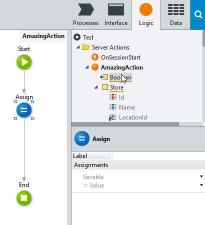

<!--Not Service Studio but: how to set a timer to run x minutes-->
